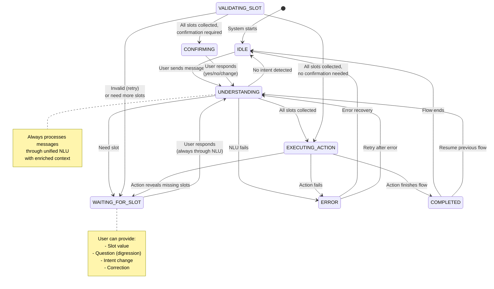
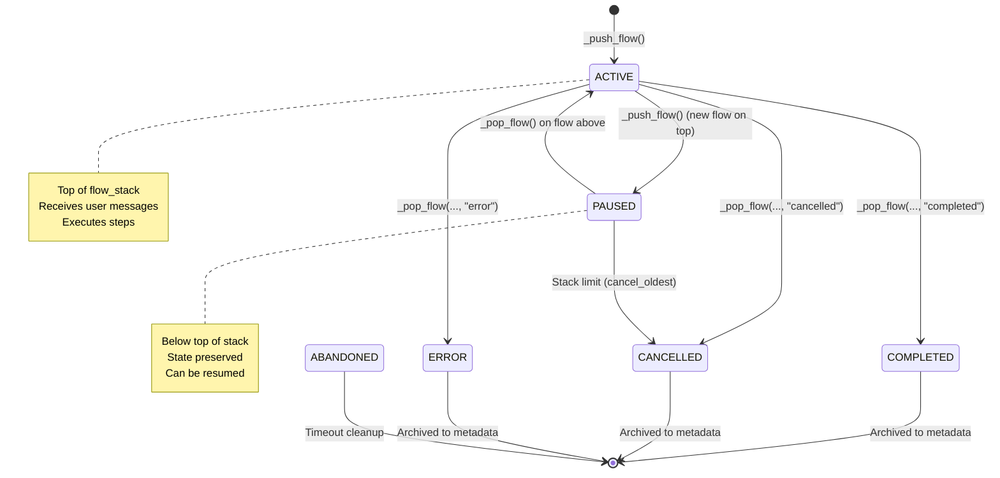

# Soni Framework - State Machine

## Overview

Soni implements an explicit state machine to track conversation progress. The command-driven architecture uses this state machine for deterministic execution - Commands modify state, and the DM routes based on state values (not LLM classification).

**Key Principle**: State transitions are triggered by Command execution, not by NLU classification.


## DialogueState Schema

We use `TypedDict` for all state structures to ensure seamless JSON serialization/deserialization during checkpointing.

### Complete Schema

```python
from typing import TypedDict, Any, Literal, Annotated
from enum import Enum
from langchain_core.messages import AnyMessage
from langgraph.graph import add_messages

class ConversationState(str, Enum):
    """Explicit conversation states"""
    IDLE = "idle"
    UNDERSTANDING = "understanding"
    WAITING_FOR_SLOT = "waiting_for_slot"
    VALIDATING_SLOT = "validating_slot"
    EXECUTING_ACTION = "executing_action"
    CONFIRMING = "confirming"
    COMPLETED = "completed"
    ERROR = "error"

# FlowState as Literal type for clean JSON serialization
FlowState = Literal["active", "paused", "completed", "cancelled", "abandoned", "error"]

class FlowContext(TypedDict):
    """
    Complete context for a specific flow execution instance.
    Stored as pure data dictionary.
    """

    flow_id: str
    """Unique instance ID (e.g., 'book_flight_3a7f'). Key for flow_slots."""

    flow_name: str
    """Name of the flow definition (e.g., 'book_flight')."""

    flow_state: FlowState
    """Current execution state of this flow instance."""

    current_step: str | None
    """Current step identifier in the flow definition. None if not started."""

    outputs: dict[str, Any]
    """
    Final outputs produced by this flow upon completion.
    Preserved in history even after flow_slots are pruned.
    """

    started_at: float
    """Unix timestamp when flow was started."""

    paused_at: float | None
    """Unix timestamp when flow was paused. None if never paused."""

    completed_at: float | None
    """Unix timestamp when flow completed. None if still active/paused."""

    context: str | None
    """Human-readable reason for pause/cancel (debugging aid)."""

class DialogueState(TypedDict):
    """Complete dialogue state schema (Pure Data)"""

    # ===== Core Communication =====

    messages: Annotated[list[AnyMessage], add_messages]
    """
    Message history.
    Stored as LangChain `AnyMessage` objects for compatibility with LangGraph's
    `add_messages` reducer. Requires `langchain-core>=0.3.11`.
    Accepts dictionaries ({"role": "user", "content": "..."}) as input, but
    LangGraph converts them to message objects internally for ID tracking
    and serialization.
    """

    last_response: str
    """Last response sent to user."""

    # ===== Flow Management =====

    flow_stack: list[FlowContext]
    """
    Active flow execution stack (LIFO).
    - Empty list: No active flows
    - Bottom: Root/oldest flow
    - Top: Currently active flow

    Source of truth for current flow: flow_stack[-1] (if exists)
    """

    flow_slots: dict[str, dict[str, Any]]
    """
    Storage for flow instance data (the "data heap").

    Key: flow_id (unique instance ID)
    Value: dict of slot name → slot value

    Example:
        {
            "book_flight_3a7f": {"origin": "NYC", "destination": "LHR"},
            "book_flight_9c2d": {"origin": "MAD", "destination": "BCN"}
        }
    """

    # ===== Conversation State Tracking =====

    conversation_state: ConversationState
    """
    What the system is currently doing.
    High-level state machine for conversation control flow.
    """

    current_step: str | None
    """
    Identifier of current step in active flow.
    None if no active flow or flow hasn't started execution.
    """

    waiting_for_slot: str | None
    """
    Name of slot we're expecting from user.
    Set when conversation_state == WAITING_FOR_SLOT.
    """

    # ===== NLU Tracking =====

    last_nlu_call: float | None
    """
    Unix timestamp of last NLU call.
    Used for caching and debugging.
    """

    # ===== Digression Tracking =====

    digression_depth: int
    """
    How many digressions deep are we?
    0 = main flow, >0 = in digression
    """

    last_digression_type: str | None
    """Type of last digression (question, help, clarification, etc.)."""

    # ===== Command Audit (New in v2.0) =====

    command_log: list[dict[str, Any]]
    """
    Log of all executed commands for audit trail.
    Each entry: {"command": str, "args": dict, "timestamp": float, "result": str}

    Example:
        [
            {"command": "StartFlow", "args": {"flow_name": "book_flight"}, "timestamp": 1701234567.89, "result": "success"},
            {"command": "SetSlot", "args": {"slot_name": "origin", "value": "NYC"}, "timestamp": 1701234570.12, "result": "success"}
        ]
    """

    # ===== Metadata & Audit =====

    turn_count: int
    """Number of conversation turns."""

    trace: list[dict[str, Any]]
    """
    Audit trail of events.
    Each entry: {"event": str, "timestamp": float, "data": dict}
    """

    metadata: dict[str, Any]
    """
    Archive and system metadata.

    Standard keys:
        - completed_flows: list[FlowContext] - Archive of completed/cancelled flows
        - error: str | None - Last error message
        - error_at: float | None - Timestamp of last error
    """
```

### Design Decisions

#### Why No `current_flow` Field?

**Decision**: We do NOT include a separate `current_flow: str` field.

**Rationale**:
- **Single Source of Truth**: `flow_stack[-1]["flow_name"]` is the definitive current flow
- **No Synchronization Risk**: Cached/derived fields can desynchronize
- **O(1) Access**: `flow_stack[-1]` is constant time in Python
- **Minimal State**: Fewer fields = simpler state, smaller serialization

**Access Pattern**:
```python
def get_current_flow_name(state: DialogueState) -> str | None:
    """Get currently active flow name."""
    return state["flow_stack"][-1]["flow_name"] if state["flow_stack"] else None
```

### Key Fields Explained

#### conversation_state

Tracks what the system is currently doing (High-Level State Machine):

| State | Description | Typical Duration |
|-------|-------------|------------------|
| `IDLE` | No active flow | Until user sends message |
| `UNDERSTANDING` | Processing user intent via NLU | 200-500ms |
| `WAITING_FOR_SLOT` | Expecting specific slot value | Until user responds |
| `VALIDATING_SLOT` | Validating provided value | 10-100ms |
| `EXECUTING_ACTION` | Running external action | 100ms-5s |
| `CONFIRMING` | Asking for confirmation | Until user confirms |
| `COMPLETED` | Flow finished | Momentary |
| `ERROR` | Error occurred | Until recovery |

#### flow_stack (The Execution Stack)

Stack of flow instances. The top element is always the active flow.

```python
flow_stack = [
    # Bottom: Root flow (Paused)
    {
        "flow_id": "book_flight_3a7f",
        "flow_name": "book_flight",
        "flow_state": "paused",
        "current_step": "collect_origin",
        "outputs": {},
        "started_at": 1701234567.89,
        "paused_at": 1701234590.12,
        "completed_at": None,
        "context": "User wants to check booking first"
    },
    # Top: Active interrupt flow
    {
        "flow_id": "check_booking_9c2d",
        "flow_name": "check_booking",
        "flow_state": "active",
        "current_step": "request_ref",
        "outputs": {},
        "started_at": 1701234590.12,
        "paused_at": None,
        "completed_at": None,
        "context": None
    }
]
```

**Properties**:
- LIFO (Last In, First Out) semantics
- Top of stack = active flow
- Below top = paused flows (can be resumed)
- Empty stack = no active flows (IDLE state)

#### flow_slots (The Data Heap)

Stores data by unique instance ID, allowing multiple concurrent flows of the same type.

```python
flow_slots = {
    # Data for the paused flow
    "book_flight_3a7f": {"origin": "NYC", "destination": "LHR"},

    # Data for the active flow
    "check_booking_9c2d": {"booking_ref": "BK-999"}
}
```

**Key Benefits**:
- Prevents name collisions between flow instances
- Enables concurrent flows of same type
- Clear data ownership (flow_id → data)
- Easy cleanup when flow completes

## State Transitions

### Conversation State Machine



### Flow State Machine



## State Validation

Custom validator ensures only valid conversation state transitions.

```python
class StateTransitionValidator:
    """Validates conversation state transitions."""

    VALID_TRANSITIONS: dict[ConversationState, list[ConversationState]] = {
        ConversationState.IDLE: [
            ConversationState.UNDERSTANDING,
        ],
        ConversationState.UNDERSTANDING: [
            ConversationState.WAITING_FOR_SLOT,
            ConversationState.EXECUTING_ACTION,
            ConversationState.IDLE,
            ConversationState.ERROR,
        ],
        ConversationState.WAITING_FOR_SLOT: [
            ConversationState.UNDERSTANDING,  # Always back through NLU
        ],
        ConversationState.VALIDATING_SLOT: [
            ConversationState.WAITING_FOR_SLOT,
            ConversationState.CONFIRMING,
            ConversationState.EXECUTING_ACTION,
        ],
        ConversationState.EXECUTING_ACTION: [
            ConversationState.CONFIRMING,
            ConversationState.COMPLETED,
            ConversationState.WAITING_FOR_SLOT,
            ConversationState.ERROR,
        ],
        ConversationState.CONFIRMING: [
            ConversationState.UNDERSTANDING,
            ConversationState.EXECUTING_ACTION,
            ConversationState.WAITING_FOR_SLOT,
        ],
        ConversationState.COMPLETED: [
            ConversationState.IDLE,
            ConversationState.UNDERSTANDING,
        ],
        ConversationState.ERROR: [
            ConversationState.IDLE,
            ConversationState.UNDERSTANDING,
        ],
    }

    @classmethod
    def validate_transition(
        cls,
        from_state: ConversationState,
        to_state: ConversationState
    ) -> None:
        """
        Validate state transition.

        Raises:
            ValueError: If transition is invalid
        """
        valid_targets = cls.VALID_TRANSITIONS.get(from_state, [])
        if to_state not in valid_targets:
            raise ValueError(
                f"Invalid transition from {from_state} to {to_state}. "
                f"Valid transitions: {valid_targets}"
            )
```

## Cross-Flow Data Transfer

Data transfer happens explicitly via **Outputs** and **Inputs**.

### The Pattern

1.  **Outputs**: When a flow completes, it saves results to `FlowContext.outputs`
2.  **Archive**: Completed flow (with outputs) is stored in `metadata["completed_flows"]`
3.  **Inputs**: New flow is started with explicit `inputs` extracted from archived outputs

### Example

```python
# Step 1: Flow completes with outputs
outputs = {
    "booking_ref": "BK-123",
    "status": "confirmed",
    "departure_date": "2025-12-15"
}
_pop_flow(state, outputs=outputs)

# Step 2: Extract from archive
completed_flows = state["metadata"]["completed_flows"]
last_flow = completed_flows[-1]
booking_ref = last_flow["outputs"]["booking_ref"]

# Step 3: Start new flow with explicit inputs
_push_flow(
    state,
    "modify_booking",
    inputs={"booking_ref": booking_ref},
    reason="User wants to modify"
)
```

**Benefits**:
- Flows don't need to know WHERE data came from
- Clear data contracts (inputs → flow → outputs)
- Easy to test flows in isolation
- Explicit dependencies

## Memory Management

Since `DialogueState` persists across entire conversation, we must prune it.

### What Gets Pruned

1.  **Orphan flow_slots**: Data for flows no longer in stack
2.  **Old completed flows**: Keep only last N in metadata
3.  **Message history**: Keep last N messages
4.  **Trace events**: Keep last N events

### Configuration

```yaml
settings:
  memory_management:
    max_history_messages: 50
    max_trace_events: 100
    max_completed_flows: 10
```

### Implementation

```python
def _prune_state(self, state: DialogueState) -> None:
    """Prune state to prevent unbounded growth."""

    # 1. Prune orphan flow slots
    active_ids = {ctx["flow_id"] for ctx in state["flow_stack"]}
    orphan_ids = [fid for fid in state["flow_slots"] if fid not in active_ids]

    for fid in orphan_ids:
        del state["flow_slots"][fid]

    # 2. Prune old completed flows
    max_completed = self.config.memory_management.max_completed_flows
    completed = state["metadata"].get("completed_flows", [])

    if len(completed) > max_completed:
        state["metadata"]["completed_flows"] = completed[-max_completed:]

    # 3. Prune message history
    max_messages = self.config.memory_management.max_history_messages
    if len(state["messages"]) > max_messages:
        state["messages"] = state["messages"][-max_messages:]

    # 4. Prune trace
    max_trace = self.config.memory_management.max_trace_events
    if len(state["trace"]) > max_trace:
        state["trace"] = state["trace"][-max_trace:]
```

## State Initialization

```python
def create_initial_state() -> DialogueState:
    """Create initial dialogue state for new conversation."""
    return {
        # Core communication
        "messages": [],
        "last_response": "",

        # Flow management
        "flow_stack": [],
        "flow_slots": {},

        # Conversation state
        "conversation_state": ConversationState.IDLE,
        "current_step": None,
        "waiting_for_slot": None,

        # NLU
        "last_nlu_call": None,

        # Digression
        "digression_depth": 0,
        "last_digression_type": None,

        # Metadata
        "turn_count": 0,
        "trace": [],
        "metadata": {
            "completed_flows": []
        }
    }
```

## Summary

Soni's explicit state machine provides:

1.  ✅ **Command-Driven Transitions**: State changes triggered by Commands, not classification
2.  ✅ **Pure Data Architecture**: Fully serializable `TypedDict` structure
3.  ✅ **Command Audit Trail**: Full log of executed commands for debugging
4.  ✅ **Instance Identity**: `flow_id` allows concurrent flows of same type
5.  ✅ **Single Source of Truth**: `flow_stack` (no redundant caches)
6.  ✅ **Automatic Persistence**: Compatible with LangGraph checkpointing
7.  ✅ **Memory Management**: Automatic pruning prevents unbounded growth

**Design Philosophy**: Deterministic, auditable state transitions driven by explicit Commands.

## Next Steps

- **[05-message-flow.md](05-message-flow.md)** - Message processing pipeline
- **[11-commands.md](11-commands.md)** - Complete Command specification
- **[12-conversation-patterns.md](12-conversation-patterns.md)** - Conversation Patterns reference

---

**Design Version**: v2.0 (Command-Driven Architecture)
**Status**: Production-ready design specification
