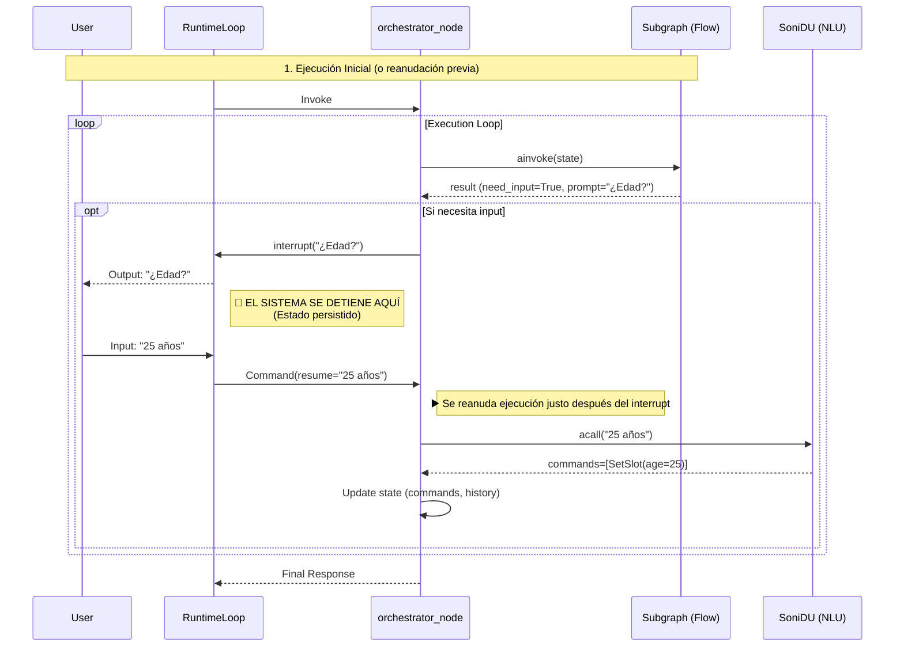

# Arquitectura de Soni Framework

Este diagrama visualiza la arquitectura implementada en `src/soni`, destacando el flujo de ejecución, el ciclo de vida de la conversación y la gestión del estado "Human-in-the-loop".

## Detalles del Flujo

1.  **Entrada**: `RuntimeLoop` recibe el mensaje. Si hay una interrupción pendiente, se reanuda con `Command(resume=...)`.
2.  **Understand**:
    - Ejecuta NLU (Doble pasada).
    - Procesa `StartFlow`/`CancelFlow` inmediatamente para persistir cambios en el stack.
3.  **Execute**:
    - Invoca el subgrafo del flujo activo.
    - Si el subgrafo necesita input, dispara `interrupt()`.
    - Al reanudarse, procesa la respuesta del usuario con NLU interno si es necesario y continúa el bucle.
4.  **Estado**:
    - `FlowManager` genera deltas inmutables (`FlowDelta`).
    - El estado global se actualiza mediante reducers.
# Flujo de Interrupción

Este diagrama de secuencia detalla exactamente qué sucede cuando el sistema necesita preguntar algo al usuario y esperar su respuesta.

## Explicación paso a paso

1.  **Detección de necesidad**: El subgrafo del flujo (ej. `onboarding`) detecta que falta un dato (ej. la edad) y devuelve `need_input=True` junto con la pregunta (`prompt`).
2.  **La Interrupción**:
    - El nodo `orchestrator_node` ve esta señal y retorna `TaskAction.INTERRUPT`.
    - **Punto Clave**: La ejecución del código Python se detiene y retorna el control. El estado se guarda en la base de datos (Checkpointer).
    - El usuario recibe la pregunta.
3.  **La Espera**: El sistema no está corriendo. Está esperando pasivamente.
4.  **La Reanudación**:
    - Cuando el usuario responde ("25 años"), `RuntimeLoop` busca el hilo pausado y envía un comando de reanudación (`Command(resume=...)`).
    - `orchestrator_node` "despierta" procesando el comando de reanudación. La variable que recogía el resultado de `interrupt()` ahora contiene "25 años".
5.  **Procesamiento**:
    - Como el subgrafo no sabe de lenguaje natural, `orchestrator_node` llama al NLU (`SoniDU`) con la respuesta del usuario.
    - El NLU traduce "25 años" a comandos estructurados: `SetSlot(age=25)`.
    - Se actualiza el estado y el bucle continúa, volviendo a invocar al subgrafo, que ahora ya tendrá el dato y avanzará al siguiente paso.
