# Soni Framework Architecture

This diagram visualizes the architecture implemented in `src/soni`, highlighting the execution flow, conversation lifecycle, and "Human-in-the-loop" state management.

## Flow Details

1.  **Input**: `RuntimeLoop` receives the message. If there is a pending interruption, it resumes with `Command(resume=...)`.
2.  **Understand**:
    - Executes NLU (Two-Pass).
    - Processes `StartFlow`/`CancelFlow` immediately to persist stack changes.
3.  **Execute**:
    - Invokes the active flow subgraph.
    - If the subgraph needs input, it triggers `interrupt()`.
    - Upon resumption, it processes the user response with internal NLU if necessary and continues the loop.
4.  **State**:
    - `FlowManager` generates immutable deltas (`FlowDelta`).
    - The global state is updated via reducers.
# Interrupt Flow

This sequence diagram details exactly what happens when the system needs to ask the user something and wait for their response.

```mermaid
sequenceDiagram
    participant User
    participant RL as RuntimeLoop
    participant ORCH as orchestrator_node
    participant Sub as Subgraph (Flow)
    participant NLU as SoniDU (NLU)

    Note over User, Sub: 1. Initial Execution (or previous resumption)

    RL->>ORCH: Invoke
    loop Execution Loop
        ORCH->>Sub: ainvoke(state)
        Sub-->>ORCH: result (need_input=True, prompt="Age?")

        opt If input needed
            ORCH->>RL: interrupt("Age?")
            RL-->>User: Output: "Age?"

            Note right of RL: 🛑 SYSTEM STOPS HERE <br/>(State persisted)

            User->>RL: Input: "25 years"
            RL->>ORCH: Command(resume="25 years")

            Note right of ORCH: ▶️ Execution resumes right after interrupt

            ORCH->>NLU: acall("25 years")
            NLU-->>ORCH: commands=[SetSlot(age=25)]

            ORCH->>ORCH: Update state (commands, history)
        end
    end
    ORCH-->>RL: Final Response
```

## Step-by-Step Explanation

1.  **Need Detection**: The flow subgraph (e.g., `onboarding`) detects missing data (e.g., age) and returns `need_input=True` along with the question (`prompt`).
2.  ** The Interruption**:
    - The `orchestrator_node` sees this signal and returns `TaskAction.INTERRUPT`.
    - **Key Point**: Python code execution stops and returns control. State is saved to the database (Checkpointer).
    - The user receives the question.
3.  **The Wait**: The system is not running. It is waiting passively.
4.  **The Resumption**:
    - When the user responds ("25 years"), `RuntimeLoop` finds the paused thread and sends a resume command (`Command(resume=...)`).
    - `orchestrator_node` "wakes up" processing the resume command. The variable that collected the `interrupt()` result now contains "25 years".
5.  **Processing**:
    - Since the subgraph doesn't know natural language, `orchestrator_node` calls the NLU (`SoniDU`) with the user's response.
    - The NLU translates "25 years" into structured commands: `SetSlot(age=25)`.
    - State is updated and the loop continues, re-invoking the subgraph, which will now have the data and proceed to the next step.
