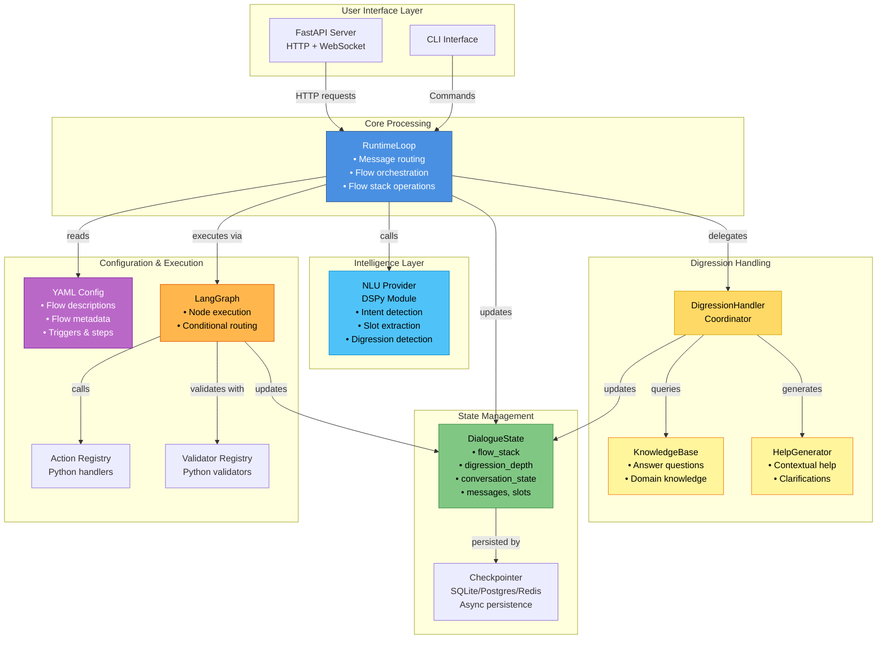

# Soni Framework - Architecture

## Architectural Principles

### 1. Explicit State Machine

The system maintains an explicit state machine that tracks conversation progress:
- Current flow and step
- What the system is waiting for (slot, confirmation, action result)
- Conversation state (IDLE, WAITING_FOR_SLOT, EXECUTING_ACTION, etc.)

**Benefits**:
- Enables context-aware message processing
- Provides rich context to NLU for better understanding
- Makes debugging and testing straightforward
- Supports complex conversation patterns (interruptions, resumption)

**Example**:

```python
class ConversationState(Enum):
    IDLE = "idle"                    # No active flow
    UNDERSTANDING = "understanding"   # Processing user intent
    WAITING_FOR_SLOT = "waiting_for_slot"  # Expecting slot value
    EXECUTING_ACTION = "executing_action"  # Running action
    CONFIRMING = "confirming"         # Asking for confirmation
```

### 2. Context-Aware NLU

Every user message flows through a unified NLU with enriched context. The NLU receives:
- Current conversation state and position
- Flow descriptions and metadata
- Paused flows that can be resumed
- Recent conversation history

**Benefits**:
- Single code path for all message types
- Consistent behavior across scenarios
- Better accuracy through context
- Easier to maintain and optimize

**Example**:

```python
async def understand_node(state: DialogueState):
    """
    ALWAYS first node - processes ALL user messages.

    NLU determines if user provided:
    - Slot value ("New York")
    - Question ("What cities?")
    - Intent change ("Cancel")
    - Resume request ("Go back to booking")
    """
    context = build_nlu_context(state)
    result = await nlu_provider.predict(state["user_message"], context)
    return {"nlu_result": result}
```

### 3. Resumable Execution

LangGraph's checkpointing enables automatic conversation resumption:
- State saved after each node execution
- Each user has isolated conversation via `thread_id`
- `interrupt()` pauses execution waiting for user input
- `Command(resume=)` continues execution with user response

**Benefits**:
- No manual state tracking needed
- Automatic resume from correct position
- Lower latency (skip already-executed nodes)
- Lower cost (no redundant LLM calls)

**Example**:

```python
async def process_message(msg: str, user_id: str) -> str:
    config = {"configurable": {"thread_id": user_id}}

    # Check if interrupted
    current_state = await graph.aget_state(config)

    if current_state.next:
        # Resume with user response
        result = await graph.ainvoke(
            Command(resume={"user_message": msg}),
            config=config
        )
    else:
        # New conversation
        result = await graph.ainvoke(initial_state, config=config)

    return result["last_response"]
```

### 4. Zero-Leakage Architecture

YAML describes WHAT should happen (semantics), Python implements HOW (logic):

**YAML Example**:

```yaml
# YAML: Semantic contract
actions:
  search_flights:
    inputs: [origin, destination, date]
    outputs: [flights, price]
```

**Python Example**:

```python
# Python: Implementation
@ActionRegistry.register("search_flights")
async def search_flights(origin: str, destination: str, date: str):
    response = await http_client.get(f"https://api.example.com/flights?...")
    return {"flights": response["data"], "price": response["total_price"]}
```

**Benefits**:
- Business analysts can modify flows without coding
- Technical details (HTTP, regex, SQL) stay in Python
- Configuration remains readable and maintainable

### 5. SOLID Principles

Use interfaces (Protocols) for dependency injection and testability:

```python
class INLUProvider(Protocol):
    async def predict(self, context: NLUContext) -> NLUOutput: ...

class IActionHandler(Protocol):
    async def execute(self, action: str, inputs: dict[str, Any]) -> dict[str, Any]: ...

class IScopeManager(Protocol):
    def get_available_actions(self, state: DialogueState) -> list[str]: ...
```

**Benefits**:
- Components are loosely coupled
- Easy to test with mocks
- Easy to swap implementations

### 6. Async-First

Everything is async - no sync wrappers, no blocking I/O:

```python
async def process_message(msg: str) -> str:
    """All I/O operations are async"""
    nlu_result = await nlu.predict(msg, context)
    action_result = await action_handler.execute(action, inputs)
    await checkpointer.save(state)
    return response
```

**Benefits**:
- Maximum concurrency and throughput
- Native support for streaming
- Modern Python best practices

## High-Level Architecture

### System Layers

```
┌─────────────────────────────────────────────────────┐
│                   User Interface                     │
│            (FastAPI, WebSocket, CLI)                 │
└────────────────────┬────────────────────────────────┘
                     │
┌────────────────────▼────────────────────────────────┐
│              Core Processing Layer                   │
│  RuntimeLoop (Orchestrator)                         │
│   - Message routing                                  │
│   - Flow stack helpers (push/pop)                   │
│   - Delegates to:                                    │
│     • DigressionHandler (coordinator)               │
│       ├─ KnowledgeBase (answers questions)          │
│       └─ HelpGenerator (generates help)             │
└────────────────────┬────────────────────────────────┘
                     │
        ┌────────────┴────────────┐
        │                         │
┌───────▼──────┐          ┌──────▼──────┐
│   NLU Layer  │          │ Graph Layer │
│              │          │             │
│ - DSPy/LLM   │          │ - LangGraph │
│ - Context    │          │ - Nodes     │
│ - Caching    │          │ - Routing   │
└───────┬──────┘          └──────┬──────┘
        │                         │
        └────────────┬────────────┘
                     │
┌────────────────────▼────────────────────────────────┐
│              State Management Layer                  │
│  - DialogueState (flow_stack, conversation_state)   │
│  - Checkpointer (SQLite/Postgres/Redis)             │
│  - Conversation history & Audit logs                │
└─────────────────────────────────────────────────────┘
```

### Core Components



### Component Responsibilities

| Component | Responsibility |
|-----------|---------------|
| **RuntimeLoop** | Main orchestrator: routes messages, manages conversation flow, handles flow stack operations (push/pop) |
| **DigressionHandler** | Coordinates digression handling by delegating to specialized components |
| **KnowledgeBase** | Answers domain-specific questions using knowledge base, RAG, or documentation |
| **HelpGenerator** | Generates contextual help and clarifications based on current conversation state |
| **NLU Provider** | Complete understanding: intent detection, slot extraction, digression detection |
| **DialogueState** | Central state with flow_stack and conversation context |
| **Checkpointer** | Async persistence to SQLite/Postgres/Redis |
| **LangGraph** | Node execution engine with conditional routing |
| **YAML Config** | Declarative flow definitions with rich metadata |

## Technology Stack

### Core Dependencies

| Component | Technology | Version | Rationale |
|-----------|-----------|---------|-----------|
| **Language** | Python | 3.11+ | Modern async, type hints, performance |
| **Dialogue Management** | LangGraph | 1.0.4+ | State graphs, checkpointing, resumable execution |
| **NLU** | DSPy | 3.0.4+ | Automatic prompt optimization |
| **LLM Providers** | OpenAI, Anthropic | Latest | Fast NLU models (gpt-4o-mini, claude-3-haiku) |
| **Web Framework** | FastAPI | 0.122.0+ | Async, WebSocket, modern Python |
| **Persistence** | SQLite/Postgres/Redis | Latest | Flexible checkpointing backends |
| **Validation** | Pydantic | 2.12.5+ | Data validation, schema enforcement |

### Why These Technologies?

**LangGraph**:
- Native support for state graphs and checkpointing
- Resumable execution (critical for our design)
- Built-in persistence layer
- Active development and community

**DSPy**:
- Automatic prompt optimization via metrics
- Reduces manual prompt engineering
- Supports multiple LLM providers
- Compiled modules are serializable

**FastAPI**:
- Native async support
- WebSocket for streaming
- Automatic API documentation
- Modern Python typing

**SQLite/PostgreSQL/Redis**:
- SQLite for development and small deployments
- PostgreSQL for production with high concurrency
- Redis for high-performance distributed deployments

## Key Design Decisions

### Always Through NLU First

Every user message must pass through NLU, even when waiting for a slot:

```python
# ❌ WRONG - Assuming user provides slot value directly
def collect_slot_node(state):
    user_input = interrupt("Where would you like to fly from?")
    state["slots"]["origin"] = user_input  # PROBLEM!
    return state

# ✅ CORRECT - Always through NLU first
def collect_slot_node(state):
    user_response = interrupt({
        "prompt": "Where would you like to fly from?",
        "waiting_for": "origin"
    })
    return {"user_message": user_response, "waiting_for_slot": "origin"}

def understand_node(state):
    """ALWAYS processes user messages"""
    msg = state["user_message"]
    context = build_nlu_context(state)  # Includes waiting_for_slot
    nlu_result = await nlu.predict(msg, context)

    # NLU determines what user said
    if nlu_result.is_slot_value:
        return {"action": "validate_slot", "slot_value": nlu_result.value}
    elif nlu_result.is_digression:
        return {"action": "handle_digression", "question": nlu_result.topic}
    elif nlu_result.is_intent_change:
        return {"action": "change_intent", "new_intent": nlu_result.intent}
```

**Why**: Users don't always provide direct answers. They might ask questions, correct themselves, or change their mind.

### Flow Stack for Complex Conversations

Support flow interruptions without losing state:

```python
# User starts booking
flow_stack = [FlowContext(flow_name="book_flight", flow_state=ACTIVE)]

# User interrupts to check existing booking
flow_stack.push(FlowContext(flow_name="check_booking", flow_state=ACTIVE))
# Previous flow paused: [book_flight(PAUSED), check_booking(ACTIVE)]

# After checking, return to booking
flow_stack.pop()  # check_booking COMPLETED
# Resume: [book_flight(ACTIVE)]
```

**Implementation**: Simple list operations as RuntimeLoop helper methods (no separate manager class needed).

### Unified NLU with Context Enrichment

Single NLU module handles all understanding tasks with rich context:

```python
async def build_nlu_context(state: DialogueState) -> NLUContext:
    """Build enriched context for NLU"""
    # Get current flow from stack
    active_context = flow_manager.get_active_context(state)
    current_flow_name = active_context["flow_name"] if active_context else "none"

    return NLUContext(
        # Current state
        conversation_state=state.conversation_state,
        waiting_for_slot=state.waiting_for_slot,
        current_flow=current_flow_name,

        # Available flows with descriptions
        available_flows={
            flow_name: flow.description
            for flow_name, flow in config.flows.items()
        },

        # Paused flows that can be resumed
        paused_flows=[
            f for f in state.flow_stack
            if f.flow_state == FlowState.PAUSED
        ],

        # Recent conversation history
        history=dspy.History(messages=[
            {"user_message": msg["content"], "role": msg["role"]}
            for msg in state.messages[-10:]
        ]),
    )
```

**Benefits**: Simpler architecture, single optimization point, consistent behavior.

## Data Flow

```
User Message
  ↓
RuntimeLoop.process_message()
  ↓
Check LangGraph State (aget_state)
  ├─ If interrupted → Resume with Command(resume=msg)
  └─ If new/completed → Invoke with initial state
  ↓
LangGraph Automatically:
  - Loads checkpoint if exists (by thread_id)
  - Resumes from last saved state
  - Skips already-executed nodes
  ↓
ALWAYS → Understand Node (NLU)
  ↓
NLU analyzes message with enriched context:
  - Current conversation state
  - Flow descriptions
  - Paused flows
  - Waiting for slot
  ↓
Conditional Routing (based on NLU result)
  ├─ Slot Value → Validate Node → Check if more slots needed
  ├─ Digression → Digression Node → Re-prompt → Back to Understand
  ├─ Intent Change → Intent Change Node → Push/Pop flow stack
  ├─ Resume Request → Resume Node → Pop to requested flow
  └─ Continue → Next Step Node
  ↓
Node Execution
  ↓
If need user input → interrupt() → Pause execution
  ↓
Update DialogueState (LangGraph auto-saves checkpoint)
  ↓
Generate Response
  ↓
Return response to user
  ↓
[Next user message loops back to top]
```

## Summary

Soni v0.5 architecture is built on these foundations:

1. **Explicit state machine** - Clear tracking of conversation state and position
2. **Context-aware NLU** - Unified NLU with enriched context handles all scenarios
3. **Resumable execution** - LangGraph checkpointing for automatic save/resume
4. **Flow stack** - Support for complex conversation patterns (interruptions, resumption)
5. **Zero-leakage** - YAML for semantics, Python for implementation
6. **SOLID principles** - Interface-based design, dependency injection
7. **Async-first** - Everything is async, no blocking operations

These principles enable building sophisticated task-oriented chatbots that handle realistic human communication patterns.

## Next Steps

- **[03-components.md](03-components.md)** - Detailed component responsibilities
- **[04-state-machine.md](04-state-machine.md)** - DialogueState schema and transitions
- **[05-message-flow.md](05-message-flow.md)** - Message processing pipeline
- **[06-nlu-system.md](06-nlu-system.md)** - Complete NLU architecture with structured types, testing, and production best practices

---

**Design Version**: v0.8 (Production-Ready with Structured Types)
**Status**: Production-ready design specification
