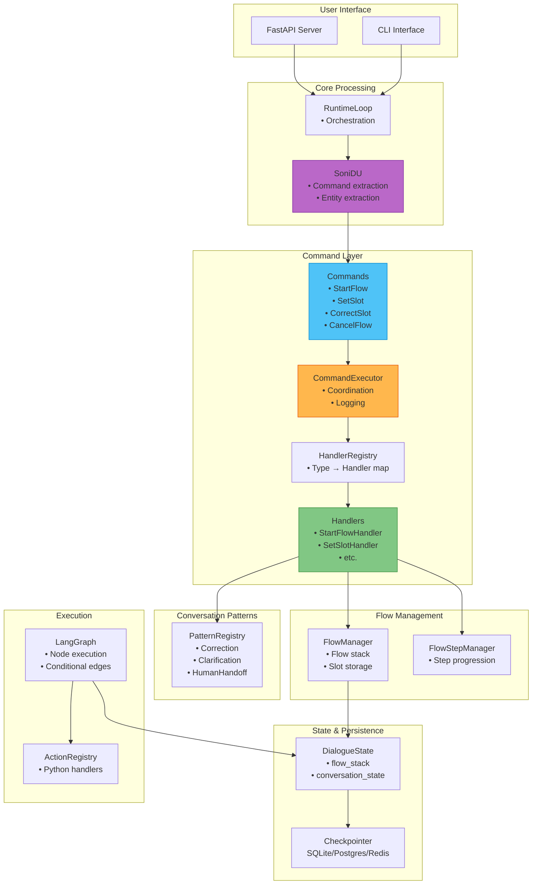

# Soni Framework - Architecture

## Architectural Principles

### 1. Command-Driven Dialogue Management

**Core Principle**: The LLM **only** interprets user input, the DM **executes deterministically**.

```
User Message → DU (LLM) → Commands → Command Executor → DM State Machine
                 ↑                         ↑
            Interprets only          Deterministic execution
```

**Benefits**:
- LLM cannot "hallucinate" actions
- All decisions are auditable
- Predictable, testable behavior
- Multiple commands per message supported

**Command Types**:

```python
class Command(BaseModel):
    """Base class for all commands (pure data)."""
    pass

class StartFlow(Command):
    flow_name: str
    slots: dict[str, Any] = {}

class SetSlot(Command):
    slot_name: str
    value: Any
    confidence: float = 1.0

class CorrectSlot(Command):
    slot_name: str
    new_value: Any

class CancelFlow(Command):
    reason: str | None = None

class Clarify(Command):
    topic: str

class AffirmConfirmation(Command):
    pass

class DenyConfirmation(Command):
    slot_to_change: str | None = None
```

### 2. Handler Registry Pattern (SOLID)

Commands are **pure data**, handlers contain **behavior**:

```python
# Protocol for all handlers
class CommandHandler(Protocol):
    async def execute(
        self,
        command: Command,
        state: DialogueState,
        context: RuntimeContext
    ) -> dict[str, Any]: ...

# Example handler
class StartFlowHandler:
    async def execute(self, cmd: StartFlow, state, context) -> dict:
        flow_id = context.flow_manager.push_flow(state, cmd.flow_name, cmd.slots)
        return {
            "conversation_state": "waiting_for_slot",
            "active_flow_id": flow_id
        }

# Registry maps command types to handlers
class CommandHandlerRegistry:
    _handlers: dict[type[Command], CommandHandler] = {
        StartFlow: StartFlowHandler(),
        SetSlot: SetSlotHandler(),
        CorrectSlot: CorrectSlotHandler(),
        CancelFlow: CancelFlowHandler(),
        Clarify: ClarifyHandler(),
        # New command = new entry here (OCP)
    }

# Executor coordinates
class CommandExecutor:
    async def execute(self, commands: list[Command], state, context) -> dict:
        updates = {}
        for command in commands:
            handler = self.registry.get(type(command))
            result = await handler.execute(command, state, context)
            updates = merge_updates(updates, result)
            self._log_command(command, result)  # Cross-cutting
        return updates
```

**SOLID Compliance**:
| Principle | Implementation |
|-----------|----------------|
| **SRP** | Commands = data, Handlers = behavior, Executor = coordination |
| **OCP** | New command = new handler class + registry entry |
| **LSP** | All handlers implement same Protocol |
| **ISP** | Each handler only knows its command type |
| **DIP** | Executor depends on Protocol, not concrete handlers |

### 3. Conversation Patterns

Declarative handling of non-happy-path scenarios:

```yaml
conversation_patterns:
  correction:
    enabled: true
    handler: CorrectionPatternHandler

  clarification:
    enabled: true
    max_depth: 3
    fallback: human_handoff

  human_handoff:
    enabled: true
    trigger_conditions:
      - clarification_depth > 3
      - explicit_request
```

**Built-in Patterns**:
- **Correction**: `CorrectSlot` command handling
- **Clarification**: `Clarify` command handling
- **Cancellation**: `CancelFlow` command handling
- **Human Handoff**: `HumanHandoff` command handling

### 4. Explicit State Machine

The system maintains an explicit state machine that tracks conversation progress:

```python
class ConversationState(StrEnum):
    IDLE = "idle"                      # No active flow
    UNDERSTANDING = "understanding"     # Processing via NLU
    WAITING_FOR_SLOT = "waiting_for_slot"
    EXECUTING_ACTION = "executing_action"
    CONFIRMING = "confirming"
    COMPLETED = "completed"
```

**Benefits**:
- Enables context-aware NLU
- Makes debugging straightforward
- Supports complex conversation patterns

### 5. Resumable Execution (LangGraph)

LangGraph's checkpointing enables automatic conversation resumption:

```python
async def process_message(msg: str, user_id: str) -> str:
    config = {"configurable": {"thread_id": user_id}}

    current_state = await graph.aget_state(config)

    if current_state.next:
        # Resume with user response
        result = await graph.ainvoke(
            Command(resume={"user_message": msg}),
            config=config
        )
    else:
        # New conversation
        result = await graph.ainvoke(initial_state, config=config)

    return result["last_response"]
```

### 6. Zero-Leakage Architecture

YAML describes WHAT should happen (semantics), Python implements HOW (logic):

```yaml
# YAML: Semantic contract
actions:
  search_flights:
    inputs: [origin, destination, date]
    outputs: [flights, price]
```

```python
# Python: Implementation
@ActionRegistry.register("search_flights")
async def search_flights(origin: str, destination: str, date: str):
    response = await http_client.get(f"https://api.example.com/flights?...")
    return {"flights": response["data"], "price": response["total_price"]}
```

### 7. Async-First

Everything is async - no sync wrappers, no blocking I/O:

```python
async def process_message(msg: str) -> str:
    """All I/O operations are async"""
    commands = await nlu.predict(msg, context)  # Produces Commands
    updates = await command_executor.execute(commands, state, context)
    await checkpointer.save(state)
    return response
```

## High-Level Architecture

### System Layers

```
┌─────────────────────────────────────────────────────┐
│                   User Interface                     │
│            (FastAPI, WebSocket, CLI)                 │
└────────────────────┬────────────────────────────────┘
                     │
┌────────────────────▼────────────────────────────────┐
│              Core Processing Layer                   │
│  RuntimeLoop (Orchestrator)                         │
│   - Receives messages                               │
│   - Invokes NLU (produces Commands)                 │
│   - Delegates to CommandExecutor                    │
└────────────────────┬────────────────────────────────┘
                     │
         ┌───────────┴────────────┐
         │                        │
┌────────▼──────┐         ┌──────▼───────┐
│   DU Layer    │         │ Command Layer │
│               │         │               │
│ - SoniDU      │────────▶│ - Commands    │
│ - DSPy/LLM    │         │ - Handlers    │
│ - Context     │         │ - Registry    │
└───────────────┘         │ - Executor    │
                          └──────┬────────┘
                                 │
                     ┌───────────▼───────────┐
                     │                       │
              ┌──────▼──────┐        ┌──────▼──────┐
              │ FlowManager │        │ Patterns    │
              │             │        │             │
              │ - push/pop  │        │ - Correction│
              │ - slots     │        │ - Clarify   │
              └──────┬──────┘        │ - Cancel    │
                     │               └─────────────┘
         ┌───────────┴───────────┐
         │                       │
┌────────▼──────┐         ┌─────▼───────┐
│ Graph Layer   │         │ State Layer │
│               │         │             │
│ - LangGraph   │◄───────▶│ - Dialogue  │
│ - Nodes       │         │ - Checkpoint│
└───────────────┘         └─────────────┘
```

### Core Components



### Component Responsibilities

| Component | Responsibility |
|-----------|----------------|
| **RuntimeLoop** | Main orchestrator: receives messages, invokes NLU, delegates to CommandExecutor |
| **SoniDU** | Produces Commands from user input (LLM-powered) |
| **Commands** | Pure data representing user intent (Pydantic models) |
| **CommandHandlers** | Execute individual commands (one handler per command type) |
| **HandlerRegistry** | Maps command types to handlers (OCP-compliant) |
| **CommandExecutor** | Coordinates handler execution, adds cross-cutting concerns |
| **ConversationPatterns** | Declarative handling of non-happy-path scenarios |
| **FlowManager** | Flow stack operations (push/pop), slot storage |
| **DialogueState** | Central state with flow_stack and conversation context |
| **Checkpointer** | Async persistence to SQLite/Postgres/Redis |
| **LangGraph** | Node execution engine with conditional routing |

## Data Flow

```
User Message
  ↓
RuntimeLoop.process_message()
  ↓
Check LangGraph State (aget_state)
  ├─ If interrupted → Resume with Command(resume=msg)
  └─ If new/completed → Invoke with initial state
  ↓
LangGraph Automatically:
  - Loads checkpoint if exists
  - Resumes from last saved state
  ↓
Understand Node (SoniDU)
  ├─ Analyze with LLM
  └─ Produce list[Command]
  ↓
Execute Commands Node (CommandExecutor)
  ├─ For each command:
  │   ├─ Lookup handler in registry
  │   ├─ handler.execute(command, state, context)
  │   └─ Merge state updates
  └─ Log all commands for audit
  ↓
DM State Machine determines next step:
  ├─ Need more slots → collect_next_slot → interrupt()
  ├─ Ready for action → execute_action
  ├─ Need confirmation → confirm → interrupt()
  └─ Flow complete → pop_flow
  ↓
Generate Response
  ↓
Save State (automatic checkpoint)
  ↓
Return response to user
```

## Technology Stack

| Component | Technology | Version | Rationale |
|-----------|------------|---------|-----------|
| **Language** | Python | 3.11+ | Modern async, type hints |
| **Dialogue Management** | LangGraph | 1.0.4+ | State graphs, checkpointing |
| **NLU** | DSPy | 3.0.4+ | Automatic prompt optimization |
| **LLM Providers** | OpenAI, Anthropic | Latest | gpt-4o-mini, claude-3-haiku |
| **Web Framework** | FastAPI | 0.122.0+ | Async, WebSocket |
| **Persistence** | SQLite/Postgres/Redis | Latest | Flexible checkpointing |
| **Validation** | Pydantic | 2.12.5+ | Commands, state validation |

## Summary

Soni v2.0 architecture is built on these foundations:

1. **Command-driven DM** - LLM interprets, DM executes deterministically
2. **Handler Registry** - SOLID-compliant command execution
3. **Conversation Patterns** - Declarative non-happy-path handling
4. **Explicit state machine** - Clear tracking of conversation state
5. **Resumable execution** - LangGraph checkpointing
6. **Zero-leakage** - YAML for semantics, Python for implementation
7. **Async-first** - Everything is async

## Next Steps

- **[03-components.md](03-components.md)** - Detailed component responsibilities
- **[04-state-machine.md](04-state-machine.md)** - DialogueState schema and transitions
- **[11-commands.md](11-commands.md)** - Complete Command layer specification
- **[12-conversation-patterns.md](12-conversation-patterns.md)** - Conversation Patterns reference

---

**Design Version**: v2.0 (Command-Driven Architecture)
**Status**: Production-ready design specification
