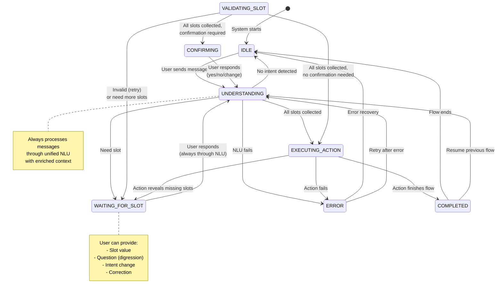
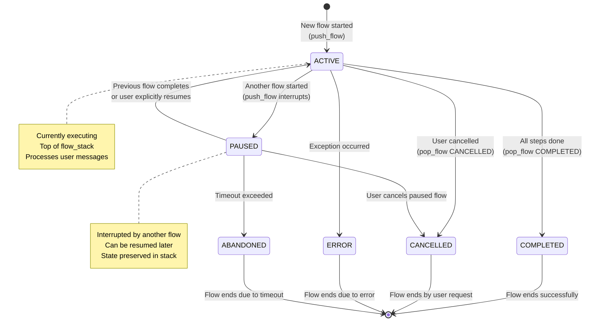

# Soni Framework - State Machine

## Overview

Soni implements an explicit state machine to track conversation progress. This provides clear visibility into what the system is doing at any moment and enables context-aware message processing.

## DialogueState Schema

### Complete Schema

```python
from enum import Enum
from typing import Any, TypedDict
from dataclasses import dataclass

class ConversationState(str, Enum):
    """Explicit conversation states"""
    IDLE = "idle"
    UNDERSTANDING = "understanding"
    WAITING_FOR_SLOT = "waiting_for_slot"
    VALIDATING_SLOT = "validating_slot"
    EXECUTING_ACTION = "executing_action"
    CONFIRMING = "confirming"
    COMPLETED = "completed"
    ERROR = "error"

class FlowState(str, Enum):
    """State of a flow in the stack"""
    ACTIVE = "active"
    PAUSED = "paused"
    COMPLETED = "completed"
    CANCELLED = "cancelled"
    ABANDONED = "abandoned"
    ERROR = "error"

@dataclass
class FlowContext:
    """Complete context for a flow in the stack"""
    flow_name: str
    flow_state: FlowState
    current_step: str | None
    collected_slots: dict[str, Any]
    outputs: dict[str, Any]  # For cross-flow data transfer
    started_at: float
    paused_at: float | None = None
    completed_at: float | None = None
    context: str | None = None  # Why paused/cancelled

class DialogueState(TypedDict):
    """Complete dialogue state schema"""

    # Core state
    messages: list[dict[str, str]]
    """Message history: {"role": "user"|"assistant", "content": str}"""

    slots: dict[str, Any]
    """Global slots (deprecated in favor of flow_slots)"""

    flow_slots: dict[str, dict[str, Any]]
    """Flow-scoped slots: {flow_name: {slot_name: value}}"""

    current_flow: str
    """Currently active flow name"""

    # Explicit state tracking
    conversation_state: ConversationState
    """What are we doing right now?"""

    current_step: str | None
    """Where are we in the flow?"""

    waiting_for_slot: str | None
    """Which slot are we expecting?"""

    last_nlu_call: float | None
    """Timestamp of last NLU call (for caching)"""

    # Flow management
    flow_stack: list[FlowContext]
    """Stack of flows (active + paused)"""

    # Digression tracking
    digression_depth: int
    """How many digressions deep? 0 = main flow"""

    last_digression_type: str | None
    """Type of last digression"""

    # Metadata
    turn_count: int
    """Number of turns in this conversation"""

    last_response: str
    """Last response sent to user"""

    trace: list[dict[str, Any]]
    """Audit trail of events"""

    metadata: dict[str, Any]
    """Additional metadata for extensions"""
```

### Key Fields

#### conversation_state

Tracks what the system is currently doing:

| State | Description | Typical Duration |
|-------|-------------|------------------|
| `IDLE` | No active flow | Until user sends message |
| `UNDERSTANDING` | Processing user intent via NLU | 200-500ms |
| `WAITING_FOR_SLOT` | Expecting specific slot value | Until user responds |
| `VALIDATING_SLOT` | Validating provided value | 10-100ms |
| `EXECUTING_ACTION` | Running external action | 100ms-5s |
| `CONFIRMING` | Asking for confirmation | Until user confirms |
| `COMPLETED` | Flow finished | Momentary |
| `ERROR` | Error occurred | Until recovery |

#### flow_stack

Stack of flow contexts supporting complex conversations:

```python
# Example: User starts booking, then checks existing booking
flow_stack = [
    FlowContext(
        flow_name="book_flight",
        flow_state=FlowState.PAUSED,
        current_step="collect_origin",
        collected_slots={},
        paused_at=1701234567.89
    ),
    FlowContext(
        flow_name="check_booking",
        flow_state=FlowState.ACTIVE,
        current_step="request_booking_ref",
        collected_slots={},
        started_at=1701234590.12
    )
]
```

#### flow_slots

Flow-scoped slots prevent naming conflicts:

```python
# Without scoping (problematic):
slots = {"origin": "NYC", "destination": "LA"}
# If user switches flows, which origin applies?

# With flow scoping (correct):
flow_slots = {
    "book_flight": {"origin": "NYC", "destination": "LA"},
    "modify_booking": {"booking_ref": "BK123", "origin": "Boston"}
}
```

## State Transitions

### Conversation State Machine



### Flow State Machine



### State Validation

Custom validator ensures only valid transitions:

```python
class StateTransitionValidator:
    """Validates state transitions"""

    VALID_TRANSITIONS: dict[ConversationState, list[ConversationState]] = {
        ConversationState.IDLE: [
            ConversationState.UNDERSTANDING,
        ],
        ConversationState.UNDERSTANDING: [
            ConversationState.WAITING_FOR_SLOT,
            ConversationState.EXECUTING_ACTION,
            ConversationState.IDLE,
            ConversationState.ERROR,
        ],
        ConversationState.WAITING_FOR_SLOT: [
            ConversationState.UNDERSTANDING,  # Always back through NLU
        ],
        ConversationState.VALIDATING_SLOT: [
            ConversationState.WAITING_FOR_SLOT,  # Invalid or need more
            ConversationState.CONFIRMING,  # All collected, needs confirmation
            ConversationState.EXECUTING_ACTION,  # All collected, no confirmation
        ],
        ConversationState.EXECUTING_ACTION: [
            ConversationState.CONFIRMING,  # Action needs confirmation
            ConversationState.COMPLETED,
            ConversationState.WAITING_FOR_SLOT,
            ConversationState.ERROR,
        ],
        ConversationState.CONFIRMING: [
            ConversationState.UNDERSTANDING,  # Process user's yes/no
            ConversationState.EXECUTING_ACTION,  # After confirmed
            ConversationState.WAITING_FOR_SLOT,  # User wants to change something
        ],
        ConversationState.COMPLETED: [
            ConversationState.IDLE,
            ConversationState.UNDERSTANDING,
        ],
        ConversationState.ERROR: [
            ConversationState.IDLE,
            ConversationState.UNDERSTANDING,
        ],
    }

    @classmethod
    def validate_transition(
        cls,
        from_state: ConversationState,
        to_state: ConversationState
    ) -> None:
        """
        Validate state transition.

        Raises:
            ValueError: If transition is invalid
        """
        valid_targets = cls.VALID_TRANSITIONS.get(from_state, [])
        if to_state not in valid_targets:
            raise ValueError(
                f"Invalid transition from {from_state} to {to_state}. "
                f"Valid transitions: {valid_targets}"
            )
```

**Design Decision**: Custom validation (not `transitions` library) because:
- LangGraph already manages state as dict
- `transitions` library assumes control of state object (incompatible)
- Custom validation provides core benefit without complexity
- No external dependency needed

## State Persistence

### Checkpointing

State automatically saved after each node execution via LangGraph:

```python
from langgraph.checkpoint.sqlite import SqliteSaver

# Create checkpointer
checkpointer = SqliteSaver.from_conn_string("dialogue_state.db")

# Compile graph with checkpointer
graph = builder.compile(checkpointer=checkpointer)

# State automatically saved per user via thread_id
config = {"configurable": {"thread_id": user_id}}
result = await graph.ainvoke(input_state, config=config)
```

### Thread Isolation

Each user conversation isolated by `thread_id`:

```python
# User 1
result = await graph.ainvoke(
    input_state,
    config={"configurable": {"thread_id": "user_1"}}
)

# User 2 (completely separate state)
result = await graph.ainvoke(
    input_state,
    config={"configurable": {"thread_id": "user_2"}}
)
```

### State Recovery

Load previous state to continue conversation:

```python
# Check if conversation interrupted
current_state = await graph.aget_state(
    config={"configurable": {"thread_id": user_id}}
)

if current_state.next:
    # Interrupted - resume
    result = await graph.ainvoke(
        Command(resume={"user_message": msg}),
        config={"configurable": {"thread_id": user_id}}
    )
```

## Flow-Scoped Slots

### Problem

Same slot names across different flows cause conflicts:

```yaml
book_flight:
  slots: [origin, destination, date]

modify_booking:
  slots: [booking_ref, origin, destination, date]  # Same names!
```

### Solution

Flow-scoped slots with helper methods:

```python
def _get_slot(self, state: DialogueState, slot_name: str) -> Any:
    """Get slot from current flow's scope"""
    active_flow = self._get_active_flow(state)
    if active_flow:
        return state.flow_slots.get(active_flow.flow_name, {}).get(slot_name)
    return None

def _set_slot(self, state: DialogueState, slot_name: str, value: Any):
    """Set slot in current flow's scope"""
    active_flow = self._get_active_flow(state)
    if active_flow:
        if active_flow.flow_name not in state.flow_slots:
            state.flow_slots[active_flow.flow_name] = {}
        state.flow_slots[active_flow.flow_name][slot_name] = value
```

**Benefits**:
- No naming conflicts between flows
- Clear ownership of slot values
- Automatic cleanup when flow completes

## Cross-Flow Data Transfer

### Problem

Flows need to pass data to each other:

```
User: "Check my booking"
Bot:  "BK-12345 is confirmed for Dec 15"
User: "I want to modify that booking"
      # How does modify_booking get booking_ref?
```

### Solution

FlowContext.outputs field:

```python
@dataclass
class FlowContext:
    # ... other fields ...
    outputs: dict[str, Any] = field(default_factory=dict)

# When check_booking completes
flow_context.outputs["booking_ref"] = "BK-12345"
flow_context.outputs["booking_status"] = "confirmed"

# When modify_booking starts
previous_flow = state.metadata.get("completed_flows", [])[-1]
if "booking_ref" in previous_flow.outputs:
    initial_slots = {"booking_ref": previous_flow.outputs["booking_ref"]}
```

## Memory Management

### Problem

Long conversations cause unbounded growth:
- `state.messages` grows infinitely
- `state.trace` grows infinitely
- Completed flows accumulate

### Solution

Configurable pruning:

```yaml
settings:
  memory_management:
    max_history_messages: 50
    max_trace_events: 100
    archive_completed_flows_after: 10
```

```python
def _prune_state(self, state: DialogueState):
    """Prune state to prevent unbounded growth"""

    # Prune message history
    if len(state.messages) > self.config.max_history_messages:
        state.messages = state.messages[-self.config.max_history_messages:]

    # Prune trace
    if len(state.trace) > self.config.max_trace_events:
        state.trace = state.trace[-self.config.max_trace_events:]

    # Archive old completed flows
    completed = state.metadata.get("completed_flows", [])
    if len(completed) > self.config.archive_completed_flows_after:
        state.metadata["completed_flows"] = completed[-self.config.archive_completed_flows_after:]
```

## Examples

### Simple Slot Collection

```python
# Initial state
state = {
    "conversation_state": ConversationState.IDLE,
    "current_flow": "none",
    "flow_stack": [],
    "messages": []
}

# User: "I want to book a flight"
# → IDLE → UNDERSTANDING
nlu_result = await nlu.predict(msg, context)
# NLU detects intent: book_flight

# Activate flow
state.conversation_state = ConversationState.WAITING_FOR_SLOT
state.waiting_for_slot = "origin"
state.flow_stack = [FlowContext(flow_name="book_flight", flow_state=FlowState.ACTIVE)]

# Bot: "Where would you like to fly from?"
# → interrupt() pauses execution

# User: "New York"
# → WAITING_FOR_SLOT → UNDERSTANDING
nlu_result = await nlu.predict("New York", context={
    "waiting_for_slot": "origin",
    "conversation_state": ConversationState.WAITING_FOR_SLOT
})
# NLU detects: slot_value="New York", slot_name="origin"

# → VALIDATING_SLOT
is_valid = validate_city("New York")  # True

# Store in flow-scoped slots
state.flow_slots["book_flight"]["origin"] = "New York"

# Check if more slots needed
if more_slots_needed:
    state.conversation_state = ConversationState.WAITING_FOR_SLOT
    state.waiting_for_slot = "destination"
```

### Flow Interruption

```python
# Active: book_flight
state.flow_stack = [
    FlowContext(flow_name="book_flight", flow_state=FlowState.ACTIVE)
]

# User: "Actually, let me check my booking first"
# NLU detects intent change: check_booking

# Push new flow
_push_flow(state, "check_booking", reason="User wants to check first")

# State after push
state.flow_stack = [
    FlowContext(flow_name="book_flight", flow_state=FlowState.PAUSED),
    FlowContext(flow_name="check_booking", flow_state=FlowState.ACTIVE)
]

# ... complete check_booking ...

# Pop flow
_pop_flow(state, FlowState.COMPLETED)

# State after pop (automatically resumes)
state.flow_stack = [
    FlowContext(flow_name="book_flight", flow_state=FlowState.ACTIVE)
]
```

## Summary

Soni's explicit state machine provides:

1. **Clear visibility** - Know exactly what system is doing
2. **Context-aware processing** - NLU receives rich context
3. **Flow management** - Support complex conversation patterns
4. **State isolation** - Flow-scoped slots prevent conflicts
5. **Automatic persistence** - LangGraph checkpointing
6. **Memory management** - Configurable pruning

These features enable building sophisticated task-oriented chatbots that handle realistic human communication.

## Next Steps

- **[05-message-flow.md](05-message-flow.md)** - Message processing pipeline
- **[07-flow-management.md](07-flow-management.md)** - Flow stack mechanics
- **[08-langgraph-integration.md](08-langgraph-integration.md)** - LangGraph patterns

---

**Design Version**: v0.8 (Production-Ready with Structured Types)
**Status**: Production-ready design specification
