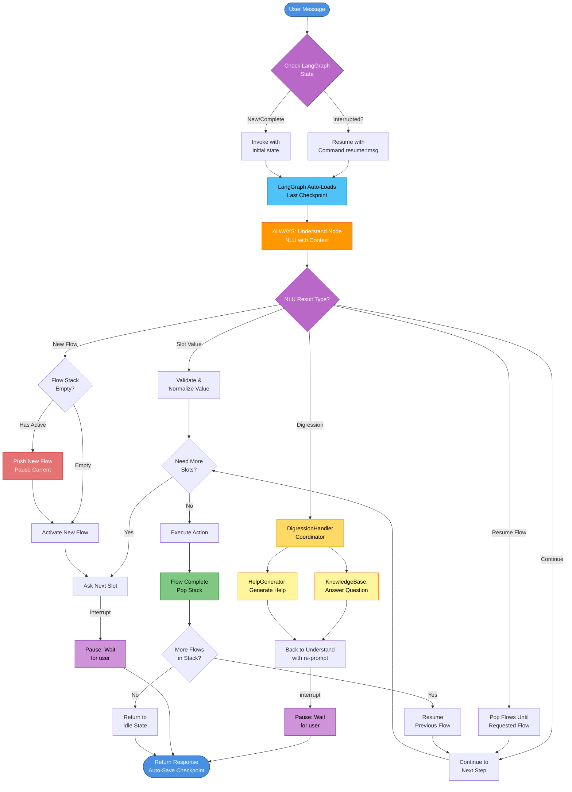
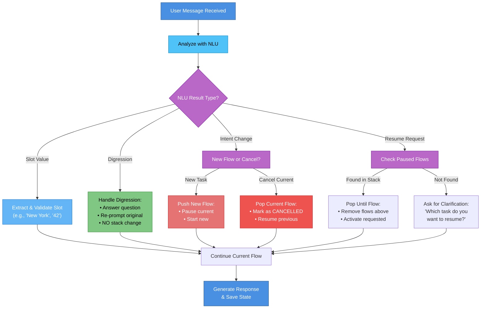

# Soni Framework - Message Flow

## Overview

Every user message in Soni flows through a unified processing pipeline with context-aware NLU at its core. This document details how messages are processed, routed, and handled.

## Core Principle: Always Through NLU First

**Critical Pattern**: Every user message MUST pass through NLU first, even when waiting for a specific slot.

###Why This Matters

When the system asks "Where would you like to fly from?", the user might respond with:
- `"New York"` - Direct slot value
- `"What cities do you support?"` - Question (digression)
- `"Actually, I want to cancel"` - Intent change
- `"Change the destination to LA first"` - Correction

The NLU determines what type of response it is and routes accordingly.

## Message Processing Flow



**Legend**:
- 🔵 Blue: Entry/Exit points
- 🟠 Orange: CRITICAL - Understand Node (ALWAYS first)
- 🔷 Cyan: LangGraph automatic checkpoint loading
- 🟣 Purple: Decision points and interrupt pauses
- 🟡 Yellow: Digression handling components
- 🔴 Red: Flow stack push
- 🟢 Green: Flow completion

## Context-Aware Routing

### Building NLU Context

Every NLU call receives enriched context with structured types:

```python
import dspy

async def build_nlu_context(state: DialogueState) -> tuple[dspy.History, DialogueContext]:
    """Build enriched context for NLU with structured types"""

    # Build conversation history using dspy.History
    history = dspy.History(messages=[
        {
            "user_message": msg["content"],
            "role": msg["role"]
        }
        for msg in state.messages[-10:]  # Last 10 turns
    ])

    # Get current flow name from stack
    active_flow = context.flow_manager.get_active_context(state)
    current_flow_name = active_flow["flow_name"] if active_flow else "none"

    # Get slots from active flow
    current_slots = state["flow_slots"].get(active_flow["flow_id"], {}) if active_flow else {}

    # Build structured dialogue context
    context = DialogueContext(
        current_slots=current_slots,
        available_actions=[
            action_name
            for action_name, action in config.actions.items()
        ],
        available_flows=[
            flow_name
            for flow_name, flow in config.flows.items()
        ],
        current_flow=current_flow_name,
        expected_slots=get_expected_slots(state, config)
    )

    return history, context
```

### Decision Logic



### Examples by Message Type

| User Message | NLU Detection | System Action |
|--------------|---------------|---------------|
| "New York" | Slot value | Extract, validate, store |
| "What cities do you support?" | Digression (question) | Answer + re-prompt, NO stack change |
| "Actually, I want to cancel" | Intent change | Push cancel_flow OR pop current |
| "Go back to booking" | Resume request | Pop to book_flight |
| "Why do you need my date?" | Digression (clarification) | Explain + re-prompt |
| "Help" | Digression (help) | Show capabilities + re-prompt |

## Implementation

### Understand Node

Always the first node - processes ALL user messages with structured types:

```python
import dspy

async def understand_node(
    state: DialogueState,
    context: RuntimeContext
) -> dict[str, Any]:
    """
    ALWAYS processes user messages with NLU using structured types.

    Determines if user provided:
    - Slot value
    - Question
    - Intent change
    - Resume request
    - Correction
    """
    user_message = state["user_message"]

    # Build conversation history using dspy.History
    history = dspy.History(messages=[
        {
            "user_message": msg["content"],
            "role": msg["role"]
        }
        for msg in state.messages[-10:]  # Last 10 turns
    ])

    # Get active flow context
    active_ctx = context.flow_manager.get_active_context(state)
    current_flow_name = active_ctx["flow_name"] if active_ctx else "none"
    current_slots = state["flow_slots"].get(active_ctx["flow_id"], {}) if active_ctx else {}

    # Build structured dialogue context
    dialogue_context = DialogueContext(
        current_slots=current_slots,
        available_actions=context.scope_manager.get_available_actions(state),
        available_flows=context.scope_manager.get_available_flows(state),
        current_flow=current_flow_name,
        expected_slots=get_expected_slots(state, context.config)
    )

    # Call NLU with structured types - understands ANY type of message
    nlu_result: NLUOutput = await context.nlu_provider.understand(
        user_message=user_message,
        history=history,
        context=dialogue_context
    )

    # Extract flat slots dict for state
    extracted_slots = {
        slot.name: slot.value
        for slot in nlu_result.slots
    }

    return {
        "nlu_result": nlu_result.model_dump(),  # Serialize for checkpoint
        "conversation_state": ConversationState.UNDERSTANDING.value,
        "last_nlu_call": time.time(),
        "slots": {**state.slots, **extracted_slots}
    }
```

### Conditional Routing

Route based on NLU result type:

```python
def route_after_understand(state: DialogueState) -> str:
    """Route based on NLU result and conversation state"""
    result = state["nlu_result"]
    conv_state = ConversationState(state["conversation_state"])

    # If we're in confirming state, handle confirmation response
    if conv_state == ConversationState.CONFIRMING:
        return "handle_confirmation"

    # Route based on NLU result message_type
    match result.message_type:
        case MessageType.SLOT_VALUE:
            return "validate_slot"
        case MessageType.CORRECTION:
            return "handle_correction"
        case MessageType.MODIFICATION:
            return "handle_modification"
        case MessageType.INTERRUPTION:
            return "handle_interruption"
        case MessageType.DIGRESSION:
            return "handle_digression"
        case MessageType.CLARIFICATION:
            return "handle_clarification"
        case MessageType.CANCELLATION:
            return "handle_cancellation"
        case MessageType.CONFIRMATION:
            return "handle_confirmation"
        case MessageType.CONTINUATION:
            return "continue_flow"
        case _:
            return "generate_response"

def route_after_validate(state: DialogueState) -> str:
    """Route after slot validation"""
    conv_state = ConversationState(state["conversation_state"])

    if conv_state == ConversationState.READY_FOR_CONFIRMATION:
        return "confirm_action"
    elif conv_state == ConversationState.READY_FOR_ACTION:
        return "execute_action"
    else:
        return "collect_next_slot"
```

### Slot Validation

```python
async def validate_slot_node(
    state: DialogueState,
    context: RuntimeContext
) -> DialogueState:
    """Validate and store slot value"""
    nlu_result = state["nlu_result"]
    slot_name = state["waiting_for_slot"]
    value = nlu_result.slot_value

    # Get current flow name from stack
    active_ctx = context.flow_manager.get_active_context(state)
    current_flow_name = active_ctx["flow_name"] if active_ctx else "none"

    # Get validator for this slot
    slot_config = get_slot_config(current_flow_name, slot_name)
    validator = ValidatorRegistry.get(slot_config.validator)

    # Validate
    is_valid = await validator(value)

    if not is_valid:
        return {
            "conversation_state": ConversationState.WAITING_FOR_SLOT,
            "last_response": f"Invalid {slot_name}. Please try again."
        }

    # Normalize
    normalizer = NormalizerRegistry.get(slot_config.normalizer)
    normalized_value = await normalizer(value)

    # Store in flow-scoped slots
    context.flow_manager.set_slot(state, slot_name, normalized_value)
    state["waiting_for_slot"] = None

    # Check if we need more slots
    next_slot = get_next_required_slot(state)
    if next_slot:
        return {
            "conversation_state": ConversationState.WAITING_FOR_SLOT,
            "waiting_for_slot": next_slot,
            "last_response": get_slot_prompt(next_slot)
        }
    else:
        # All slots collected - check what's the next step in the flow
        next_step = get_next_step_in_flow(state)

        if next_step and next_step.type == "confirm":
            return {
                "conversation_state": ConversationState.READY_FOR_CONFIRMATION,
                "current_step": next_step.name
            }
        elif next_step and next_step.type == "action":
            return {
                "conversation_state": ConversationState.READY_FOR_ACTION,
                "current_step": next_step.name
            }
        else:
            # Default to action if no explicit next step
            return {
                "conversation_state": ConversationState.READY_FOR_ACTION
            }
```

### Digression Handling

```python
async def handle_digression_node(state: DialogueState) -> DialogueState:
    """
    Handle digression without changing flow stack.

    Answer question/provide help, then re-prompt original question.
    """
    nlu_result = state["nlu_result"]

    # Delegate to DigressionHandler
    response = await digression_handler.handle(
        state,
        nlu_result.digression_type,
        nlu_result.digression_topic
    )

    # Generate re-prompt based on waiting_for_slot
    if state["waiting_for_slot"]:
        # Get current flow from stack
        active_ctx = context.flow_manager.get_active_context(state)
        current_flow_name = active_ctx["flow_name"] if active_ctx else "none"

        slot_config = get_slot_config(current_flow_name, state["waiting_for_slot"])
        reprompt = slot_config.prompt
    else:
        reprompt = "How can I help you?"

    return {
        "last_response": f"{response}\n\n{reprompt}",
        "digression_depth": state.digression_depth + 1,
        "conversation_state": ConversationState.WAITING_FOR_SLOT
        # Note: NO flow_stack change for digressions
    }
```

### Confirmation Handling

```python
async def confirm_action_node(
    state: DialogueState,
    context: RuntimeContext
) -> DialogueState:
    """
    Ask user to confirm collected information before executing action.

    Reads confirmation message from the step definition and shows collected slots.
    """
    # Get current flow from stack
    active_ctx = context.flow_manager.get_active_context(state)
    current_flow_name = active_ctx["flow_name"] if active_ctx else "none"

    # Get slots from active flow
    slots = state["flow_slots"].get(active_ctx["flow_id"], {}) if active_ctx else {}

    # Get the current confirm step from flow configuration
    current_step = get_step_config(current_flow_name, state["current_step"])

    # Build confirmation message from step configuration
    confirmation_msg = current_step.message or "Let me confirm:\n"

    for slot_name, value in slots.items():
        slot_config = get_slot_config(current_flow_name, slot_name)
        display_name = slot_config.display_name or slot_name
        confirmation_msg += f"- {display_name}: {value}\n"

    confirmation_msg += "\nIs this correct?"

    # Pause and wait for user confirmation
    user_response = interrupt({
        "type": "confirmation_request",
        "prompt": confirmation_msg
    })

    return {
        "user_message": user_response,
        "conversation_state": ConversationState.CONFIRMING.value,
        "last_response": confirmation_msg
    }

async def handle_confirmation_response(state: DialogueState) -> DialogueState:
    """
    Handle user's confirmation response.

    NLU has already classified the response using ConfirmationSignature,
    so we just need to act on the structured result.
    """
    nlu_result = state["nlu_result"]

    # Sanity check: should be a confirmation response
    if result.message_type != MessageType.CONFIRMATION:
        # Edge case: user said something unrelated during confirmation
        # Treat as digression, interruption, or cancellation
        if result.message_type == MessageType.DIGRESSION:
            return {"conversation_state": ConversationState.UNDERSTANDING}
        elif result.message_type == MessageType.CLARIFICATION:
            return {"conversation_state": ConversationState.UNDERSTANDING}
        elif result.message_type == MessageType.INTERRUPTION:
            return {"conversation_state": ConversationState.UNDERSTANDING}
        elif result.message_type == MessageType.CANCELLATION:
            return {"conversation_state": ConversationState.UNDERSTANDING}
        elif result.message_type == MessageType.MODIFICATION:
            return {"conversation_state": ConversationState.UNDERSTANDING}
        else:
            # Ask again
            return {
                "conversation_state": ConversationState.CONFIRMING,
                "last_response": "I didn't understand. Is this information correct? (yes/no)"
            }

    # User confirmed
    if nlu_result.confirmation_value is True:
        return {
            "conversation_state": ConversationState.READY_FOR_ACTION,
            "last_response": "Great! Processing your request..."
        }

    # User denied - wants to change something
    elif nlu_result.confirmation_value is False:
        # Check if user specified which slot to change
        if nlu_result.slot_to_change:
            # User said "change the destination" or similar
            return {
                "conversation_state": ConversationState.WAITING_FOR_SLOT,
                "waiting_for_slot": nlu_result.slot_to_change,
                "last_response": f"What would you like to change the {nlu_result.slot_to_change} to?"
            }
        elif nlu_result.wants_to_change:
            # User said "yes I want to change something" but didn't specify what
            active_ctx = context.flow_manager.get_active_context(state)
            current_flow_name = active_ctx["flow_name"] if active_ctx else "none"

            flow_config = get_flow_config(current_flow_name)
            slot_names = [s.name for s in flow_config.slots]
            return {
                "conversation_state": ConversationState.WAITING_FOR_SLOT,
                "last_response": f"Which information would you like to change? ({', '.join(slot_names)})"
            }
        else:
            # User just said "no" without clarification
            # Cancel current flow and return to idle
            context.flow_manager.pop_flow(state, result="cancelled")

            return {
                "conversation_state": ConversationState.IDLE,
                "last_response": "Okay, I've cancelled this request. What would you like to do?"
            }

    # Unclear response
    else:
        return {
            "conversation_state": ConversationState.CONFIRMING,
            "last_response": "I didn't quite understand. Is this information correct? Please say yes or no."
        }
```

### Intent Change Handling

```python
async def handle_intent_change_node(state: DialogueState) -> DialogueState:
    """
    Handle flow interruption or cancellation.

    Push new flow (pausing current) or pop current flow.
    """
    nlu_result = state["nlu_result"]
    new_intent = nlu_result.new_intent

    if new_intent == "cancel":
        # Cancel current flow
        _pop_flow(state, FlowState.CANCELLED)

        if state.flow_stack:
            return {
                "last_response": "Cancelled. Returning to previous task.",
                "conversation_state": ConversationState.UNDERSTANDING
            }
        else:
            return {
                "last_response": "Cancelled. How else can I help?",
                "conversation_state": ConversationState.IDLE
            }

    else:
        # Start new flow (pause current)
        reason = f"User wants to {new_intent}"
        _push_flow(state, new_intent, reason)

        return {
            "conversation_state": ConversationState.WAITING_FOR_SLOT,
            "current_flow": new_intent
        }
```

## LangGraph Pattern

### Graph Construction

```python
from langgraph.graph import StateGraph, START, END
from langgraph.types import interrupt

# Create graph
builder = StateGraph(DialogueState)

# Add nodes
builder.add_node("understand", understand_node)  # ALWAYS FIRST
builder.add_node("validate_slot", validate_slot_node)
builder.add_node("handle_digression", handle_digression_node)
builder.add_node("handle_intent_change", handle_intent_change_node)
builder.add_node("handle_confirmation", handle_confirmation_response)
builder.add_node("collect_next_slot", collect_next_slot_node)
builder.add_node("confirm_action", confirm_action_node)
builder.add_node("execute_action", execute_action_node)
builder.add_node("generate_response", generate_response_node)

# Key pattern: START always goes to understand
builder.add_edge(START, "understand")

# Conditional routing from understand based on NLU result and state
builder.add_conditional_edges(
    "understand",
    route_after_understand,
    {
        "validate_slot": "validate_slot",
        "handle_digression": "handle_digression",
        "handle_intent_change": "handle_intent_change",
        "handle_confirmation": "handle_confirmation",
        "generate_response": "generate_response"
    }
)

# After handling digression, back to understand
builder.add_edge("handle_digression", "understand")

# After validating slot, check if need more slots, confirmation, or action
builder.add_conditional_edges(
    "validate_slot",
    route_after_validate,
    {
        "confirm_action": "confirm_action",
        "execute_action": "execute_action",
        "collect_next_slot": "collect_next_slot"
    }
)

# After confirmation request, back to understand (to process user's yes/no)
builder.add_edge("confirm_action", "understand")

# After handling confirmation response, route based on result
builder.add_conditional_edges(
    "handle_confirmation",
    lambda state: "execute_action" if state["conversation_state"] == ConversationState.READY_FOR_ACTION.value else "collect_next_slot",
    {
        "execute_action": "execute_action",
        "collect_next_slot": "collect_next_slot"
    }
)

# After collecting next slot, back to understand
builder.add_edge("collect_next_slot", "understand")

# After action, generate response and end
builder.add_edge("execute_action", "generate_response")
builder.add_edge("generate_response", END)

# Compile with checkpointer
checkpointer = SqliteSaver.from_conn_string("dialogue_state.db")
graph = builder.compile(checkpointer=checkpointer)
```

### Using interrupt()

Pause execution to wait for user:

```python
async def collect_next_slot_node(
    state: DialogueState,
    context: RuntimeContext
) -> DialogueState:
    """
    Ask for next slot and PAUSE execution.

    User response will go through understand_node first.
    """
    next_slot = get_next_required_slot(state)

    if next_slot:
        # Get current flow from stack
        active_ctx = context.flow_manager.get_active_context(state)
        current_flow_name = active_ctx["flow_name"] if active_ctx else "none"

        slot_config = get_slot_config(current_flow_name, next_slot)

        # Pause here - wait for user input
        user_response = interrupt({
            "type": "slot_request",
            "slot": next_slot,
            "prompt": slot_config.prompt
        })

        # This executes AFTER user responds
        # But user_response goes through understand_node first!
        return {
            "user_message": user_response,
            "waiting_for_slot": next_slot,
            "conversation_state": ConversationState.WAITING_FOR_SLOT
        }

    return state
```

## Benefits

This unified message flow provides:

1. **Consistent handling** - All messages processed the same way
2. **Context awareness** - NLU receives full conversation state
3. **Flexible responses** - Users can deviate anytime
4. **No assumptions** - System doesn't assume direct answers
5. **Single optimization point** - Optimize one NLU module
6. **Clear debugging** - Trace messages through predictable pipeline

## Next Steps

- **[06-nlu-system.md](06-nlu-system.md)** - NLU implementation details
- **[07-flow-management.md](07-flow-management.md)** - Flow stack mechanics
- **[08-langgraph-integration.md](08-langgraph-integration.md)** - LangGraph patterns

---

**Design Version**: v0.8 (Production-Ready with Structured Types)
**Status**: Production-ready design specification
