# Soni Framework - Message Flow

## Overview

Every user message in Soni flows through a unified processing pipeline. The key difference in v2.0 is that NLU produces **Commands** (not classifications), and the **CommandExecutor** executes them deterministically.

## Core Principle: NLU Produces Commands

**Critical Pattern**: NLU produces Commands, CommandExecutor executes them.

```
User Message → NLU → [Commands] → CommandExecutor → State Updates
                                        ↓
                               DM Routes on State
```

### Why This Matters

When the system asks "Where would you like to fly from?", the user might respond with:
- `"New York"` → `SetSlot(slot_name="origin", value="New York")`
- `"What cities do you support?"` → `Clarify(topic="supported_cities")`
- `"Actually, I want to cancel"` → `CancelFlow()`
- `"Change the destination to LA first"` → `CorrectSlot(slot_name="destination", new_value="LA")`

The NLU produces Commands, the DM executes them deterministically.

## Message Processing Flow

```mermaid
flowchart TD
    Start([User Message]) --> CheckState{Check LangGraph<br/>State}

    CheckState -->|Interrupted?| Resume[Resume with<br/>Command resume=msg]
    CheckState -->|New/Complete| NewInvoke[Invoke with<br/>initial state]

    Resume --> AutoLoad[LangGraph Auto-Loads<br/>Last Checkpoint]
    NewInvoke --> AutoLoad

    AutoLoad --> NLU[Understand Node<br/>SoniDU → Commands]

    NLU --> Executor[Execute Commands Node<br/>CommandExecutor]

    Executor --> StateMachine{DM Routes on<br/>conversation_state}

    StateMachine -->|waiting_for_slot| CollectNext[Collect Next Slot<br/>interrupt]
    StateMachine -->|executing_action| ExecuteAction[Execute Action]
    StateMachine -->|confirming| ConfirmAction[Confirm Action<br/>interrupt]
    StateMachine -->|completed| FlowComplete[Flow Complete<br/>Pop Stack]
    StateMachine -->|idle| Idle[Return to Idle]

    CollectNext -->|interrupt| Pause1[Pause: Wait<br/>for user]
    ConfirmAction -->|interrupt| Pause2[Pause: Wait<br/>for user]

    ExecuteAction --> FlowComplete
    FlowComplete --> CheckResume{More Flows<br/>in Stack?}
    CheckResume -->|Yes| ResumeFlow[Resume<br/>Previous Flow]
    CheckResume -->|No| Idle

    ResumeFlow --> StateMachine

    Pause1 --> Return([Return Response<br/>Auto-Save])
    Pause2 --> Return
    Idle --> Return

    style Start fill:#4a90e2,stroke:#2e5c8a,color:#ffffff
    style Return fill:#4a90e2,stroke:#2e5c8a,color:#ffffff
    style NLU fill:#ff9800,stroke:#e65100,color:#ffffff
    style Executor fill:#4caf50,stroke:#2e7d32,color:#ffffff
    style StateMachine fill:#ba68c8,stroke:#7b1fa2,color:#ffffff
    style Pause1 fill:#ce93d8,stroke:#7b1fa2,color:#000000
    style Pause2 fill:#ce93d8,stroke:#7b1fa2,color:#000000
```



**Legend**:
- 🟠 Orange: Understand Node (NLU → Commands)
- 🟢 Green: Execute Commands Node (deterministic)
- 🟣 Purple: DM State Machine (routes on state, not classification)
- 🔵 Blue: Entry/Exit points

## Command-Driven Routing

### Examples by Message Type

| User Message | Commands Produced | Handler Executed | State Update |
|--------------|-------------------|------------------|--------------|
| "New York" | `SetSlot("origin", "NYC")` | `SetSlotHandler` | `waiting_for_slot → destination` |
| "What cities?" | `Clarify("supported_cities")` | `ClarifyHandler` | `digression_depth += 1` |
| "Cancel" | `CancelFlow()` | `CancelFlowHandler` | `pop flow, resume previous` |
| "Change dest to LA" | `CorrectSlot("destination", "LA")` | `CorrectSlotHandler` | `update slot, re-validate` |
| "Yes" (confirming) | `AffirmConfirmation()` | `AffirmHandler` | `proceed to action` |
| "No, change date" | `DenyConfirmation("date")` | `DenyHandler` | `waiting_for_slot → date` |

### Multiple Commands Per Message

```python
# User: "Cancel this and check my balance"
commands = [
    CancelFlow(reason="user_request"),
    StartFlow(flow_name="check_balance")
]

# CommandExecutor executes sequentially:
# 1. CancelFlowHandler → pop current flow
# 2. StartFlowHandler → push check_balance
```

## Implementation

### Understand Node

Produces Commands from user message:

```python
async def understand_node(
    state: DialogueState,
    runtime: Runtime[RuntimeContext]
) -> dict[str, Any]:
    """
    Produce Commands from user message.

    Returns NLUOutput with list[Command].
    """
    user_message = state["user_message"]
    context = runtime.context

    # Build NLU context
    history = dspy.History(messages=[
        {"user_message": msg["content"], "role": msg["role"]}
        for msg in state["messages"][-10:]
    ])

    active_ctx = context.flow_manager.get_active_context(state)

    dialogue_context = DialogueContext(
        current_slots=state["flow_slots"].get(
            active_ctx["flow_id"], {}
        ) if active_ctx else {},
        available_flows=context.scope_manager.get_available_flows(state),
        current_flow=active_ctx["flow_name"] if active_ctx else "none",
        expected_slots=get_expected_slots(state, context.config),
        waiting_for_slot=state.get("waiting_for_slot")
    )

    # NLU produces Commands
    nlu_result: NLUOutput = await context.nlu_provider.understand(
        user_message=user_message,
        history=history,
        context=dialogue_context
    )

    return {
        "nlu_result": nlu_result.model_dump(),
        "last_nlu_call": time.time()
    }
```

### Execute Commands Node

Executes Commands via Handler Registry:

```python
async def execute_commands_node(
    state: DialogueState,
    runtime: Runtime[RuntimeContext]
) -> dict[str, Any]:
    """
    Execute all commands from NLU via CommandExecutor.

    Deterministic execution - no LLM involved.
    """
    context = runtime.context

    # Deserialize commands from NLU result
    nlu_result = NLUOutput.model_validate(state["nlu_result"])
    commands = nlu_result.commands

    # Execute via CommandExecutor
    updates = await context.command_executor.execute(
        commands=commands,
        state=state,
        context=context
    )

    return updates
```

### Deterministic Routing

Routes based on `conversation_state` (set by handlers), not NLU classification:

```python
def route_after_execute_commands(state: DialogueState) -> str:
    """
    Route based on conversation_state.

    Deterministic - no LLM involvement.
    """
    conv_state = state["conversation_state"]

    match conv_state:
        case "waiting_for_slot":
            return "collect_next_slot"
        case "executing_action":
            return "execute_action"
        case "confirming":
            return "confirm_action"
        case "completed":
            return "handle_flow_complete"
        case "idle":
            return "generate_response"
        case "error":
            return "handle_error"
        case _:
            return "generate_response"
```

### LangGraph Graph Structure

```python
def build_graph(context: RuntimeContext) -> CompiledGraph:
    """Build LangGraph with command-driven architecture."""

    builder = StateGraph(
        state_schema=DialogueState,
        context_schema=RuntimeContext
    )

    # Nodes
    builder.add_node("understand", understand_node)
    builder.add_node("execute_commands", execute_commands_node)
    builder.add_node("collect_next_slot", collect_next_slot_node)
    builder.add_node("execute_action", execute_action_node)
    builder.add_node("confirm_action", confirm_action_node)
    builder.add_node("handle_flow_complete", handle_flow_complete_node)
    builder.add_node("generate_response", generate_response_node)

    # Entry: Always start with understand
    builder.add_edge(START, "understand")

    # understand → execute_commands (always)
    builder.add_edge("understand", "execute_commands")

    # execute_commands → deterministic routing
    builder.add_conditional_edges(
        "execute_commands",
        route_after_execute_commands,
        {
            "collect_next_slot": "collect_next_slot",
            "execute_action": "execute_action",
            "confirm_action": "confirm_action",
            "handle_flow_complete": "handle_flow_complete",
            "generate_response": "generate_response",
            "handle_error": "generate_response"
        }
    )

    # collect_next_slot → uses interrupt(), resumes at understand
    builder.add_edge("collect_next_slot", "understand")

    # confirm_action → uses interrupt(), resumes at understand
    builder.add_edge("confirm_action", "understand")

    # execute_action → handle_flow_complete or collect more
    builder.add_conditional_edges(
        "execute_action",
        route_after_action,
        {
            "handle_flow_complete": "handle_flow_complete",
            "collect_next_slot": "collect_next_slot"
        }
    )

    # handle_flow_complete → generate_response or resume previous
    builder.add_conditional_edges(
        "handle_flow_complete",
        route_after_flow_complete,
        {
            "generate_response": "generate_response",
            "execute_commands": "execute_commands"  # Resume previous
        }
    )

    # generate_response → END
    builder.add_edge("generate_response", END)

    return builder.compile(checkpointer=checkpointer)
```

## Sequence Diagram

```mermaid
sequenceDiagram
    participant User
    participant RuntimeLoop
    participant LangGraph
    participant SoniDU
    participant CommandExecutor
    participant Handlers
    participant FlowManager

    User->>RuntimeLoop: "Book a flight from NYC"
    RuntimeLoop->>LangGraph: ainvoke(initial_state)

    LangGraph->>SoniDU: understand(message, context)
    SoniDU-->>LangGraph: NLUOutput[StartFlow("book_flight"), SetSlot("origin", "NYC")]

    LangGraph->>CommandExecutor: execute(commands)
    CommandExecutor->>Handlers: StartFlowHandler.execute()
    Handlers->>FlowManager: push_flow("book_flight")
    Handlers-->>CommandExecutor: {conversation_state: "waiting_for_slot"}

    CommandExecutor->>Handlers: SetSlotHandler.execute()
    Handlers->>FlowManager: set_slot("origin", "NYC")
    Handlers-->>CommandExecutor: {waiting_for_slot: "destination"}

    CommandExecutor-->>LangGraph: merged_updates

    LangGraph->>LangGraph: route → collect_next_slot
    LangGraph->>LangGraph: interrupt("Where to?")
    LangGraph-->>RuntimeLoop: response
    RuntimeLoop-->>User: "Where would you like to fly to?"
```



## Summary

Soni v2.0 message flow is characterized by:

1. ✅ **NLU → Commands**: LLM produces structured Commands
2. ✅ **CommandExecutor**: Deterministic handler-based execution
3. ✅ **State-Based Routing**: DM routes on state, not classification
4. ✅ **Multiple Commands**: Handle compound user messages
5. ✅ **Full Audit Trail**: All commands logged
6. ✅ **SOLID Compliance**: OCP via Handler Registry

## Next Steps

- **[06-nlu-system.md](06-nlu-system.md)** - NLU implementation details
- **[11-commands.md](11-commands.md)** - Complete Command specification
- **[03-components.md](03-components.md)** - Component reference

---

**Design Version**: v2.0 (Command-Driven Architecture)
**Status**: Production-ready design specification
