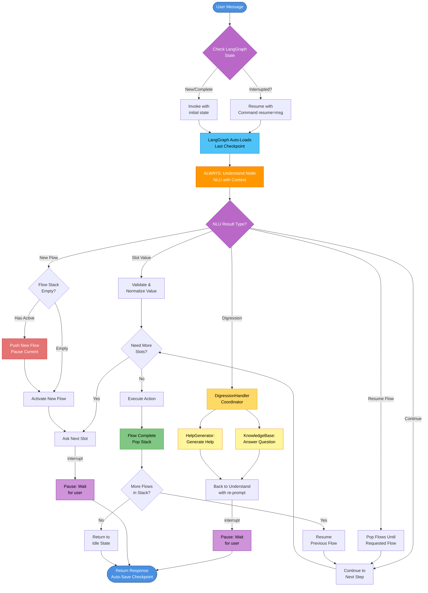
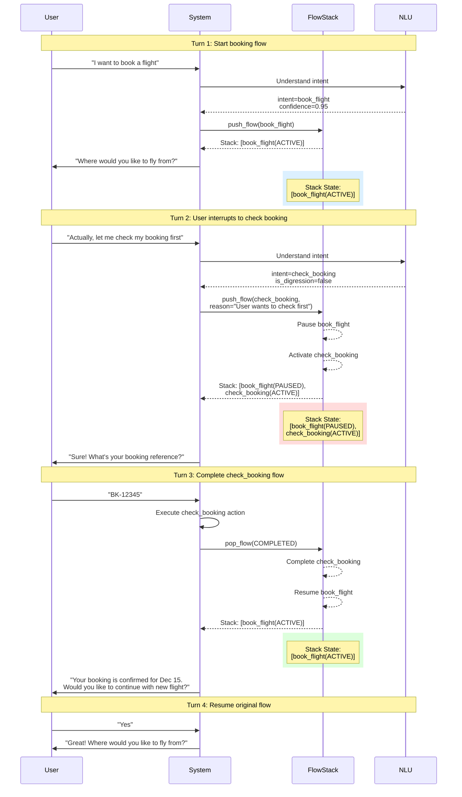

# Flow Diagrams - Complex Conversation Management

**Document Version**: 1.0
**Last Updated**: 2025-12-02
**Status**: ✅ Visual Reference

This document provides visual diagrams to understand the complex conversation management architecture described in [05-complex-conversations.md](05-complex-conversations.md).

---

## Table of Contents

- [Flow Diagrams - Complex Conversation Management](#flow-diagrams---complex-conversation-management)
  - [Table of Contents](#table-of-contents)
  - [1. Main Message Processing Flow (LangGraph Pattern)](#1-main-message-processing-flow-langgraph-pattern)
  - [2. Flow State Machine](#2-flow-state-machine)
  - [3. Flow Stack in Action](#3-flow-stack-in-action)
  - [4. Digression vs Intent Change](#4-digression-vs-intent-change)
  - [5. Multi-Flow Stack Evolution](#5-multi-flow-stack-evolution)
  - [6. Enhanced NLU Context](#6-enhanced-nlu-context)
  - [7. Core Components Overview](#7-core-components-overview)
  - [Summary](#summary)

---

## 1. Main Message Processing Flow (LangGraph Pattern)

This diagram shows the complete flow with **LangGraph checkpointing** and the critical pattern: **ALWAYS through NLU first**.

**Legend**:
- 🔵 **Blue**: Entry/Exit points
- 🟠 **Orange**: CRITICAL - Understand Node (ALWAYS first)
- 🔷 **Cyan**: LangGraph automatic checkpoint loading
- 🟣 **Purple**: Decision points and interrupt pauses
- 🟡 **Yellow**: Digression handling components
- 🔴 **Red**: Flow stack push
- 🟢 **Green**: Flow completion

**Critical Pattern**: Every user message goes through the **Understand Node (NLU)** FIRST:
- User says "New York" → NLU determines it's a slot value
- User says "What cities?" → NLU detects digression
- User says "Cancel" → NLU detects intent change

**LangGraph Patterns**:
- `interrupt()` - Pauses execution (purple boxes)
- `Command(resume=)` - Continues with user response
- Auto-checkpoint - LangGraph saves after each node automatically

---

## 2. Flow State Machine

This diagram shows the lifecycle and transitions of a flow in the stack.

```mermaid
stateDiagram-v2
    [*] --> ACTIVE: New flow started<br/>(push_flow)

    ACTIVE --> PAUSED: Another flow started<br/>(push_flow interrupts)
    ACTIVE --> COMPLETED: All steps done<br/>(pop_flow COMPLETED)
    ACTIVE --> CANCELLED: User cancelled<br/>(pop_flow CANCELLED)
    ACTIVE --> ERROR: Exception occurred<br/>(error handling)

    PAUSED --> ACTIVE: Previous flow completes<br/>OR user explicitly resumes
    PAUSED --> CANCELLED: User cancels paused flow<br/>(explicit cancel request)
    PAUSED --> ABANDONED: Timeout exceeded<br/>(max_pause_duration reached)

    COMPLETED --> [*]: Flow ends successfully
    CANCELLED --> [*]: Flow ends by user request
    ERROR --> [*]: Flow ends due to error
    ABANDONED --> [*]: Flow ends due to timeout

    note right of ACTIVE
        • Currently executing
        • Top of flow_stack
        • Processes user messages
    end note

    note right of PAUSED
        • Interrupted by another flow
        • Can be resumed later
        • State preserved in stack
    end note

    note right of COMPLETED
        • All steps executed
        • Archived in metadata
        • Success metric
    end note

    note right of ABANDONED
        • User didn't return
        • Timeout configurable
        • Can trigger cleanup
    end note
```

**State Descriptions**:
- **ACTIVE**: Currently executing (top of stack)
- **PAUSED**: Temporarily interrupted, can resume
- **COMPLETED**: Successfully finished all steps
- **CANCELLED**: User explicitly cancelled
- **ABANDONED**: Timeout - user didn't return
- **ERROR**: Failed due to exception

---

## 3. Flow Stack in Action

This sequence diagram shows a complete example of flow interruption and resumption.

**Key Points**:
- 🔵 Blue background: Single active flow
- 🔴 Red background: Multiple flows (one paused)
- 🟢 Green background: Back to single active flow
- Flow state is preserved when paused
- User can continue from where they left off

---

## 4. Digression vs Intent Change

This decision tree shows how to distinguish digressions from intent changes.

```mermaid
flowchart TD
    Message[User Message Received] --> Analyze[Analyze with NLU]

    Analyze --> Decision{NLU Result Type?}

    Decision -->|Slot Value| ExtractValue["Extract & Validate Slot<br/>(e.g., 'New York', '42')"]
    Decision -->|Digression| HandleDigression["Handle Digression:<br/>• Answer question<br/>• Re-prompt original<br/>• NO stack change"]
    Decision -->|Intent Change| IsNewFlow["New Flow or Cancel?"]
    Decision -->|Resume Request| ResumeFlow["Check Paused Flows"]

    IsNewFlow -->|New Task| PushNew["Push New Flow:<br/>• Pause current<br/>• Start new"]
    IsNewFlow -->|Cancel Current| PopCancel["Pop Current Flow:<br/>• Mark as CANCELLED<br/>• Resume previous"]

    ResumeFlow -->|Found in Stack| PopToResume["Pop Until Flow:<br/>• Remove flows above<br/>• Activate requested"]
    ResumeFlow -->|Not Found| Clarify["Ask for Clarification:<br/>'Which task do you<br/>want to resume?'"]

    ExtractValue --> Continue[Continue Current Flow]
    HandleDigression --> Continue
    PushNew --> Continue
    PopCancel --> Continue
    PopToResume --> Continue
    Clarify --> Continue

    Continue --> Response[Generate Response<br/>& Save State]

    style Message fill:#4a90e2,stroke:#2e5c8a,color:#ffffff
    style Analyze fill:#4fc3f7,stroke:#0288d1,color:#000000
    style HandleDigression fill:#81c784,stroke:#388e3c,color:#000000
    style PushNew fill:#e57373,stroke:#c62828,color:#ffffff
    style PopCancel fill:#ef5350,stroke:#c62828,color:#ffffff
    style ExtractValue fill:#64b5f6,stroke:#1976d2,color:#ffffff
    style Decision fill:#ba68c8,stroke:#7b1fa2,color:#ffffff
    style IsNewFlow fill:#ba68c8,stroke:#7b1fa2,color:#ffffff
    style ResumeFlow fill:#ba68c8,stroke:#7b1fa2,color:#ffffff
    style Response fill:#4a90e2,stroke:#2e5c8a,color:#ffffff
```

**Examples**:

| User Message | Type | NLU Action |
|--------------|------|-----------|
| "New York" | Slot Value | Extract slot value & validate |
| "What cities do you support?" | Digression (Question) | Detect digression → Answer + re-prompt, NO stack change |
| "Actually, I want to cancel instead" | Intent Change | Detect new intent → Push new flow OR cancel current |
| "Go back to booking" | Resume Request | Detect resume intent → Pop to requested flow |

**Note**: All detection and classification is done by the unified NLU provider (DSPy module).

---

## 5. Multi-Flow Stack Evolution

This diagram shows how the flow stack evolves through multiple turns.

```mermaid
flowchart LR
    subgraph T1["Turn 1: Book Flight"]
        direction TB
        S1_Flow["book_flight<br/>(ACTIVE)"]
        S1_Desc[User starts booking]
        S1_Desc -.-> S1_Flow
    end

    subgraph T2["Turn 2: Check Booking"]
        direction TB
        S2_Flow1["book_flight<br/>(PAUSED)"]
        S2_Flow2["check_booking<br/>(ACTIVE)"]
        S2_Flow1 --> S2_Flow2
        S2_Desc[User interrupts to check]
        S2_Desc -.-> S2_Flow2
    end

    subgraph T3["Turn 3: Question (Digression)"]
        direction TB
        S3_Flow1["book_flight<br/>(PAUSED)"]
        S3_Flow2["check_booking<br/>(ACTIVE)"]
        S3_Flow1 --> S3_Flow2
        S3_Diag["digression_depth: 1<br/>(NO stack change)"]
        S3_Desc[User asks question]
        S3_Desc -.-> S3_Diag
    end

    subgraph T4["Turn 4: Check Complete"]
        direction TB
        S4_Flow["book_flight<br/>(ACTIVE)"]
        S4_Desc[check_booking popped<br/>book_flight resumed]
        S4_Desc -.-> S4_Flow
    end

    subgraph T5["Turn 5: User Cancels"]
        direction TB
        S5_Empty["(empty stack)"]
        S5_Desc[book_flight CANCELLED]
        S5_Desc -.-> S5_Empty
    end

    T1 -->|"Check my<br/>booking"| T2
    T2 -->|"What cities<br/>do you fly to?"| T3
    T3 -->|"BK-12345"<br/>completes| T4
    T4 -->|"Cancel"| T5

    style T1 fill:#e3f2fd,stroke:#1976d2,color:#000000
    style T2 fill:#ffebee,stroke:#c62828,color:#000000
    style T3 fill:#fff9c4,stroke:#f57f17,color:#000000
    style T4 fill:#e8f5e9,stroke:#388e3c,color:#000000
    style T5 fill:#fce4ec,stroke:#c2185b,color:#000000

    style S1_Flow fill:#64b5f6,stroke:#1976d2,color:#ffffff
    style S2_Flow1 fill:#ffab91,stroke:#d84315,color:#000000
    style S2_Flow2 fill:#64b5f6,stroke:#1976d2,color:#ffffff
    style S3_Flow1 fill:#ffab91,stroke:#d84315,color:#000000
    style S3_Flow2 fill:#64b5f6,stroke:#1976d2,color:#ffffff
    style S3_Diag fill:#fff59d,stroke:#f57f17,color:#000000
    style S4_Flow fill:#64b5f6,stroke:#1976d2,color:#ffffff
    style S5_Empty fill:#ef9a9a,stroke:#c62828,color:#000000
```

**Color Legend**:
- 🔵 **Blue boxes**: ACTIVE flows
- 🟠 **Orange boxes**: PAUSED flows
- 🟡 **Yellow boxes**: Digressions (no stack change)
- 🔴 **Red boxes**: Cancelled/Empty states

---

## 6. Enhanced NLU Context

This diagram shows how NLU prompts are enriched with flow information.

```mermaid
flowchart TD
    UserMsg[User Message:<br/>'Check my booking'] --> BuildContext[Build Enhanced<br/>NLU Context]

    BuildContext --> AddFlows[Add Available Flows<br/>with Descriptions]
    AddFlows --> AddPaused[Add Paused Flows<br/>that can be resumed]
    AddPaused --> AddActive[Add Active Flow<br/>and current state]
    AddActive --> AddSlot[Add waiting_for_slot<br/>if applicable]

    AddSlot --> NLUPrompt[/"Enhanced NLU Prompt:<br/><br/>Available flows:<br/>• book_flight: Book new flight reservation...<br/>• check_booking: Check status of existing...<br/>• modify_booking: Change existing reservation...<br/><br/>Paused flows:<br/>• book_flight (paused at collect_origin)<br/><br/>Active flow: None<br/>Waiting for slot: None<br/><br/>User message: 'Check my booking'"/]

    NLUPrompt --> LLM[LLM Processing<br/>with Full Context]

    LLM --> Result{NLU Result<br/>Confidence?}

    Result -->|High >= 0.7| Return[Return NLU Result:<br/>• intent: check_booking<br/>• is_digression: false<br/>• confidence: 0.92]
    Result -->|Medium 0.4-0.7| Clarify[Ask Clarification:<br/>'Did you mean X or Y?']
    Result -->|Low < 0.4| Fallback[Fallback Strategy:<br/>Show available options]

    Return --> Action[Take Action:<br/>Push check_booking flow]
    Clarify --> WaitUser[Wait for User<br/>Clarification]
    Fallback --> WaitUser

    WaitUser --> UserMsg
    Action --> Execute[Execute Flow Step]

    style UserMsg fill:#4a90e2,stroke:#2e5c8a,color:#ffffff
    style NLUPrompt fill:#e1f5fe,stroke:#01579b,color:#000000
    style LLM fill:#fff9c4,stroke:#f57f17,color:#000000
    style Result fill:#ba68c8,stroke:#7b1fa2,color:#ffffff
    style Return fill:#81c784,stroke:#388e3c,color:#000000
    style Clarify fill:#ffd966,stroke:#d4a500,color:#000000
    style Fallback fill:#ffab91,stroke:#d84315,color:#000000
    style Action fill:#64b5f6,stroke:#1976d2,color:#ffffff
```

**Key Enhancements**:
1. **Flow Descriptions**: Rich semantic descriptions for each flow
2. **Paused Flows**: Context about interrupted tasks
3. **Current State**: What we're currently doing
4. **Waiting For**: What slot we're expecting (if any)

This context helps the NLU (DSPy module) make better decisions about:
- Intent classification
- Slot extraction
- Digression detection
- Resume requests
- Ambiguity resolution

---

## 7. Core Components Overview

This diagram shows how the main components interact with the refined architecture.

```mermaid
graph TB
    subgraph "User Interface Layer"
        FastAPI[FastAPI Server<br/>HTTP + WebSocket]
        CLI[CLI Interface]
    end

    subgraph "Core Processing"
        Runtime[RuntimeLoop<br/>• Message routing<br/>• Flow orchestration<br/>• Flow stack operations]
    end

    subgraph "Digression Handling"
        DigressionHandler[DigressionHandler<br/>Coordinator]
        KB[KnowledgeBase<br/>• Answer questions<br/>• Domain knowledge]
        HelpGen[HelpGenerator<br/>• Contextual help<br/>• Clarifications]
    end

    subgraph "Intelligence Layer"
        NLU[NLU Provider<br/>DSPy Module<br/>• Intent detection<br/>• Slot extraction<br/>• Digression detection]
    end

    subgraph "State Management"
        State[DialogueState<br/>• flow_stack<br/>• digression_depth<br/>• conversation_state<br/>• messages, slots]
        Checkpoint[Checkpointer<br/>SQLite/Postgres/Redis<br/>Async persistence]
    end

    subgraph "Configuration & Execution"
        YAML[YAML Config<br/>• Flow descriptions<br/>• Flow metadata<br/>• Triggers & steps]
        Graph[LangGraph<br/>• Node execution<br/>• Conditional routing]
        Actions[Action Registry<br/>Python handlers]
        Validators[Validator Registry<br/>Python validators]
    end

    FastAPI -->|HTTP requests| Runtime
    CLI -->|Commands| Runtime

    Runtime -->|delegates| DigressionHandler
    Runtime -->|calls| NLU
    Runtime -->|updates| State
    Runtime -->|reads| YAML
    Runtime -->|executes via| Graph

    DigressionHandler -->|queries| KB
    DigressionHandler -->|generates| HelpGen
    DigressionHandler -->|updates| State

    State -->|persisted by| Checkpoint

    Graph -->|calls| Actions
    Graph -->|validates with| Validators
    Graph -->|updates| State

    style Runtime fill:#4a90e2,stroke:#2e5c8a,color:#ffffff
    style DigressionHandler fill:#ffd966,stroke:#d4a500,color:#000000
    style KB fill:#fff59d,stroke:#f57f17,color:#000000
    style HelpGen fill:#fff59d,stroke:#f57f17,color:#000000
    style State fill:#81c784,stroke:#388e3c,color:#000000
    style NLU fill:#4fc3f7,stroke:#0288d1,color:#000000
    style YAML fill:#ba68c8,stroke:#7b1fa2,color:#ffffff
    style Graph fill:#ffb74d,stroke:#e65100,color:#000000
```

**Component Responsibilities**:

| Component | Responsibility |
|-----------|---------------|
| **RuntimeLoop** | Main orchestrator: routes messages, manages conversation flow, handles flow stack operations (push/pop) |
| **DigressionHandler** | Coordinates digression handling by delegating to specialized components |
| **KnowledgeBase** | Answers domain-specific questions using knowledge base, RAG, or documentation |
| **HelpGenerator** | Generates contextual help and clarifications based on current conversation state |
| **NLU Provider** | Complete understanding: intent detection, slot extraction, digression detection |
| **DialogueState** | Central state with flow_stack and conversation context |
| **Checkpointer** | Async persistence to SQLite/Postgres/Redis |
| **LangGraph** | Node execution engine with conditional routing |
| **YAML Config** | Declarative flow definitions with rich metadata |

---

## Summary

These diagrams provide a visual reference for understanding:

1. **Message Processing**: How messages flow through the system with unified NLU
2. **Flow States**: Lifecycle of flows (active → paused → completed)
3. **Stack Operations**: Push/pop mechanics with real examples (handled directly by RuntimeLoop)
4. **Decision Logic**: How NLU distinguishes digressions from intent changes
5. **Stack Evolution**: How the stack changes across multiple turns
6. **NLU Context**: How rich metadata improves NLU understanding
7. **Component Architecture**: How pieces fit together with proper separation of concerns

**Key Architectural Decisions**:

1. **Always Through NLU First**: Every user message passes through understand_node FIRST:
   - Intent detection
   - Slot extraction
   - Digression detection
   - Resume request identification
   - **Critical**: Even when waiting for a slot, because user might say anything

2. **LangGraph Native Patterns**:
   - `interrupt()`: Pauses execution to wait for user input
   - `Command(resume=)`: Continues execution with user's response
   - Automatic checkpointing: LangGraph saves after each node
   - `thread_id`: Each user has isolated checkpoint stream

3. **Decomposed Digression Handling**:
   - `DigressionHandler`: Coordinator that delegates to specialized components
   - `KnowledgeBase`: Answers domain-specific questions (RAG, documentation)
   - `HelpGenerator`: Generates contextual help and clarifications

4. **Simple Flow Stack Operations**: RuntimeLoop handles flow stack directly (push/pop are simple list operations)

5. **Single Responsibility**: Each component has a clear, focused responsibility

For implementation details, see:
- [05-complex-conversations.md](05-complex-conversations.md) - Complete design specification
- [01-architecture-overview.md](01-architecture-overview.md) - High-level architecture
- [02-state-machine.md](02-state-machine.md) - State management
- [03-message-processing.md](03-message-processing.md) - Message routing

---

**Ground Truth**: See [01-architecture-overview.md](01-architecture-overview.md) for the definitive architecture.

**Document Status**: Visual reference for complex conversation architecture
**Last Updated**: 2025-12-02 (Updated for LangGraph patterns)
**Next Review**: After implementation Phase 1
