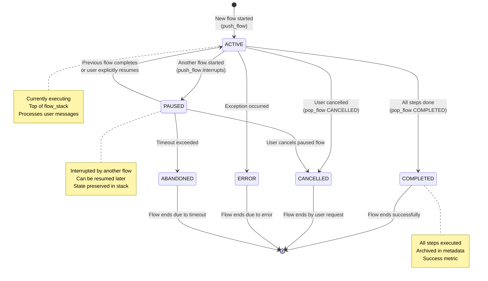
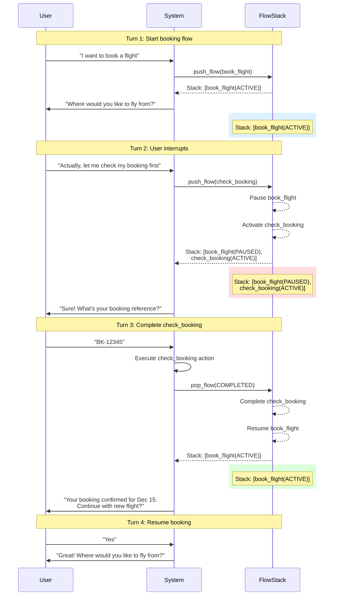

# Soni Framework - Flow Management

## Overview

Soni supports complex conversation patterns through a flow stack that enables flow interruptions, resumption, and digression handling. This document details how the system manages multiple concurrent and paused flows.

## Flow Stack Architecture

### Concept

Instead of tracking a single `current_flow`, Soni maintains a **stack of flow contexts**:

```python
state.flow_stack = [
    FlowContext(
        flow_name="book_flight",
        flow_state=FlowState.PAUSED,
        current_step="collect_origin",
        collected_slots={},
        paused_at=1701234567.89,
        context="User wants to check booking first"
    ),
    FlowContext(
        flow_name="check_booking",
        flow_state=FlowState.ACTIVE,
        current_step="request_booking_ref",
        collected_slots={},
        started_at=1701234590.12
    )
]
```

**Stack semantics**:
- **Top of stack** = Currently active flow
- **Below top** = Paused flows that can be resumed
- **Pop** when flow completes (returns to previous flow)
- **Push** when new flow starts (pauses current flow)

### FlowContext Structure

```python
from dataclasses import dataclass
from enum import Enum

class FlowState(str, Enum):
    """State of a flow in the stack"""
    ACTIVE = "active"      # Currently executing
    PAUSED = "paused"      # Interrupted, can resume
    COMPLETED = "completed"  # Finished successfully
    CANCELLED = "cancelled"  # User cancelled
    ABANDONED = "abandoned"  # Timeout exceeded
    ERROR = "error"        # Failed due to exception

@dataclass
class FlowContext:
    """Complete context for a flow in the stack"""

    flow_name: str
    """Name of the flow"""

    flow_state: FlowState
    """Current state of this flow"""

    current_step: str | None
    """Current step in the flow"""

    collected_slots: dict[str, Any]
    """Slots collected for this flow (deprecated, use flow_slots)"""

    outputs: dict[str, Any]
    """Outputs from this flow for cross-flow data transfer"""

    started_at: float
    """Timestamp when flow started"""

    paused_at: float | None = None
    """Timestamp when flow was paused"""

    completed_at: float | None = None
    """Timestamp when flow completed"""

    context: str | None = None
    """Reason why paused/cancelled (for debugging)"""
```

## Flow Stack Operations

### Push Flow

Push new flow to stack, pausing current one:

```python
def _push_flow(
    self,
    state: DialogueState,
    flow_name: str,
    reason: str | None = None
):
    """
    Push new flow to stack, pausing current one.

    Simple list operation - no separate manager class needed.
    """
    # Check depth limit
    max_depth = self.config.flow_management.max_stack_depth
    if len(state.flow_stack) >= max_depth:
        strategy = self.config.flow_management.on_limit_reached

        if strategy == "cancel_oldest":
            # Cancel oldest paused flow
            oldest = state.flow_stack.pop(0)
            oldest.flow_state = FlowState.CANCELLED
            state.metadata.setdefault("completed_flows", []).append(oldest)

        elif strategy == "reject_new":
            # Reject new flow
            raise FlowStackLimitError(
                f"Maximum flow depth ({max_depth}) reached. "
                "Please complete current task first."
            )

        elif strategy == "ask_user":
            # Ask user which flow to cancel
            return self._ask_which_flow_to_cancel(state, flow_name)

    # Pause current flow if exists
    if state.flow_stack:
        current = state.flow_stack[-1]
        current.flow_state = FlowState.PAUSED
        current.paused_at = time.time()
        current.context = reason

    # Push new flow
    new_flow = FlowContext(
        flow_name=flow_name,
        flow_state=FlowState.ACTIVE,
        current_step=None,
        collected_slots={},
        outputs={},
        started_at=time.time()
    )
    state.flow_stack.append(new_flow)
    state.current_flow = flow_name  # Backward compatibility
```

### Pop Flow

Pop current flow and resume previous one:

```python
def _pop_flow(
    self,
    state: DialogueState,
    result: FlowState = FlowState.COMPLETED
):
    """
    Pop current flow and resume previous one.

    Simple list operation - no separate manager class needed.
    """
    if not state.flow_stack:
        raise ValueError("Cannot pop empty flow stack")

    # Complete current flow
    current = state.flow_stack.pop()
    current.flow_state = result
    current.completed_at = time.time()

    # Archive completed flow
    state.metadata.setdefault("completed_flows", []).append(current)

    # Resume previous flow if exists
    if state.flow_stack:
        previous = state.flow_stack[-1]
        previous.flow_state = FlowState.ACTIVE
        state.current_flow = previous.flow_name
    else:
        state.current_flow = "none"
```

### Helper Methods

```python
def _get_active_flow(self, state: DialogueState) -> FlowContext | None:
    """Get currently active flow (top of stack)"""
    return state.flow_stack[-1] if state.flow_stack else None

def _get_paused_flows(self, state: DialogueState) -> list[FlowContext]:
    """Get all paused flows"""
    return [f for f in state.flow_stack if f.flow_state == FlowState.PAUSED]
```

## Flow State Machine



## Flow Stack Evolution

### Example Conversation



## Flow-Scoped Slots

### Problem

Same slot names across different flows cause conflicts:

```yaml
book_flight:
  slots: [origin, destination, date]

modify_booking:
  slots: [booking_ref, origin, destination, date]  # Conflict!
```

### Solution

Flow-scoped slots prevent naming conflicts:

```python
# State structure
state.flow_slots: dict[str, dict[str, Any]] = {
    "book_flight": {"origin": "NYC", "destination": "LA"},
    "modify_booking": {"booking_ref": "BK123", "origin": "Boston"}
}

# Helper methods
def _get_slot(self, state: DialogueState, slot_name: str) -> Any:
    """Get slot from current flow's scope"""
    active_flow = self._get_active_flow(state)
    if active_flow:
        return state.flow_slots.get(active_flow.flow_name, {}).get(slot_name)
    return None

def _set_slot(self, state: DialogueState, slot_name: str, value: Any):
    """Set slot in current flow's scope"""
    active_flow = self._get_active_flow(state)
    if active_flow:
        if active_flow.flow_name not in state.flow_slots:
            state.flow_slots[active_flow.flow_name] = {}
        state.flow_slots[active_flow.flow_name][slot_name] = value
```

**Benefits**:
- No naming conflicts between flows
- Clear ownership of slot values
- Automatic cleanup when flow completes
- Easier debugging (see which flow owns which slots)

## Cross-Flow Data Transfer

### Problem

Flows need to pass data to each other:

```
User: "Check my booking"
Bot:  "BK-12345 is confirmed for Dec 15"
User: "I want to modify that booking"
      # How does modify_booking get booking_ref from check_booking?
```

### Solution

Use `FlowContext.outputs` for data transfer:

```python
# When check_booking completes
flow_context.outputs["booking_ref"] = "BK-12345"
flow_context.outputs["booking_status"] = "confirmed"
flow_context.outputs["departure_date"] = "2025-12-15"

# Pop flow (automatically archives with outputs)
_pop_flow(state, FlowState.COMPLETED)

# When modify_booking starts, retrieve from completed flows
previous_flow = state.metadata.get("completed_flows", [])[-1]
if "booking_ref" in previous_flow.outputs:
    # Initialize modify_booking with booking_ref from check_booking
    _set_slot(state, "booking_ref", previous_flow.outputs["booking_ref"])
```

### Configuration

```yaml
flows:
  check_booking:
    outputs:
      - booking_ref
      - booking_status
      - departure_date

  modify_booking:
    inputs:
      - booking_ref  # Can receive from previous flow
    slots:
      - new_date
```

## Stack Depth Limiting

### Problem

Unbounded stack growth if user keeps starting new flows:

```
book_flight → check_booking → modify_booking → cancel_booking (4 levels!)
```

### Solution

Configurable depth limit with strategies:

```yaml
settings:
  flow_management:
    max_stack_depth: 3
    on_limit_reached: "cancel_oldest"  # or "reject_new" or "ask_user"
```

**Strategies**:

1. **cancel_oldest**: Cancel oldest paused flow to make room
2. **reject_new**: Reject new flow, ask user to complete current
3. **ask_user**: Ask user which flow to cancel

```python
if len(state.flow_stack) >= self.config.max_stack_depth:
    strategy = self.config.flow_management.on_limit_reached

    if strategy == "cancel_oldest":
        oldest = state.flow_stack.pop(0)
        oldest.flow_state = FlowState.CANCELLED
        state.metadata.setdefault("completed_flows", []).append(oldest)

    elif strategy == "reject_new":
        return {
            "last_response": "Please complete current task before starting a new one.",
            "conversation_state": ConversationState.UNDERSTANDING
        }

    elif strategy == "ask_user":
        options = [f.flow_name for f in state.flow_stack if f.flow_state == FlowState.PAUSED]
        return {
            "last_response": f"Which task would you like to cancel? {', '.join(options)}",
            "conversation_state": ConversationState.UNDERSTANDING
        }
```

## Ambiguous Flow Resumption

### Problem

Multiple paused flows with similar names:

```
Flow stack: [book_flight(PAUSED), check_booking(PAUSED), modify_booking(ACTIVE)]
User: "Go back to booking"  # Which booking?
```

### Solution

Rank paused flows by relevance:

```python
def _disambiguate_resume_request(
    self,
    resume_intent: str,
    paused_flows: list[FlowContext]
) -> str:
    """
    Rank paused flows by relevance to resume request.

    Factors:
    - Keyword match with flow name/description
    - Recency (more recent = higher priority)
    - Flow category similarity
    """
    scores = []
    for flow in paused_flows:
        score = 0

        # Keyword match
        if any(kw in resume_intent.lower() for kw in flow.flow_name.split("_")):
            score += 10

        # Recency (inverse of pause time)
        time_paused = time.time() - flow.paused_at
        score += 5 / (1 + time_paused / 60)  # Decay over time

        scores.append((score, flow))

    # Sort by score
    scores.sort(reverse=True, key=lambda x: x[0])

    # If ambiguous (top 2 scores similar), ask user
    if len(scores) > 1 and abs(scores[0][0] - scores[1][0]) < 2:
        return self._ask_which_flow([s[1] for s in scores[:3]])

    # Return highest scoring flow
    return scores[0][1].flow_name
```

## Digression Handling

### What is a Digression?

**Digression**: Temporary deviation that should **return to the original context** without changing the flow stack.

**Types**:
- **Questions**: "What cities do you support?"
- **Clarifications**: "Why do you need my date?"
- **Help requests**: "How does this work?"
- **Status checks**: "What information do you still need?"

**NOT digressions** (these are intent changes):
- "Actually, I want to cancel" → Intent change, push/pop flow
- "Book a different flight" → Intent change, push new flow

### Handling

```python
async def handle_digression_node(state: DialogueState) -> DialogueState:
    """
    Handle digression WITHOUT changing flow stack.

    Answer question, provide help, then re-prompt original question.
    """
    nlu_result = state["nlu_result"]

    # Delegate to DigressionHandler
    response = await digression_handler.handle(
        state,
        nlu_result.digression_type,
        nlu_result.digression_topic
    )

    # Generate re-prompt
    if state.waiting_for_slot:
        slot_config = get_slot_config(state.current_flow, state.waiting_for_slot)
        reprompt = slot_config.prompt
    else:
        reprompt = "How can I help you?"

    return {
        "last_response": f"{response}\n\n{reprompt}",
        "digression_depth": state.digression_depth + 1,
        "last_digression_type": nlu_result.digression_type.value,
        "conversation_state": ConversationState.WAITING_FOR_SLOT
        # Important: NO flow_stack change!
    }
```

## Memory Management

### Problem

Long conversations cause unbounded growth:
- Messages accumulate infinitely
- Trace events accumulate infinitely
- Completed flows accumulate infinitely

### Solution

Configurable pruning:

```yaml
settings:
  memory_management:
    max_history_messages: 50
    max_trace_events: 100
    archive_completed_flows_after: 10
```

```python
def _prune_state(self, state: DialogueState):
    """Prune state to prevent unbounded growth"""

    config = self.config.memory_management

    # Prune message history
    if len(state.messages) > config.max_history_messages:
        state.messages = state.messages[-config.max_history_messages:]

    # Prune trace
    if len(state.trace) > config.max_trace_events:
        state.trace = state.trace[-config.max_trace_events:]

    # Archive old completed flows
    completed = state.metadata.get("completed_flows", [])
    if len(completed) > config.archive_completed_flows_after:
        state.metadata["completed_flows"] = completed[-config.archive_completed_flows_after:]
```

## Summary

Soni's flow management provides:

1. **Flow stack** - Support for flow interruptions and resumption
2. **Flow-scoped slots** - Prevent naming conflicts
3. **Cross-flow data transfer** - Pass data between flows via outputs
4. **Stack depth limiting** - Prevent unbounded growth
5. **Ambiguous resumption** - Smart ranking of paused flows
6. **Digression handling** - Answer questions without changing stack
7. **Memory management** - Configurable pruning

These features enable complex, realistic conversation patterns while maintaining clear state management.

## Next Steps

- **[08-langgraph-integration.md](08-langgraph-integration.md)** - LangGraph patterns for flow execution
- **[04-state-machine.md](04-state-machine.md)** - State machine and DialogueState
- **[05-message-flow.md](05-message-flow.md)** - Message processing pipeline

---

**Design Version**: v0.8 (Production-Ready with Structured Types)
**Status**: Production-ready design specification
