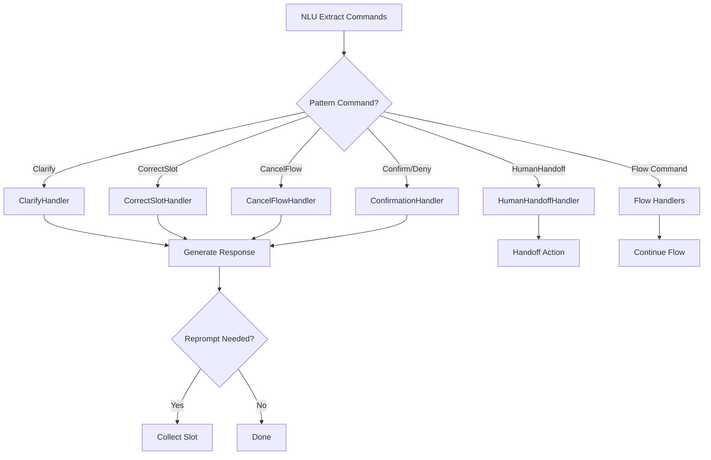

# Soni Framework - Conversation Patterns

## Overview

Conversation Patterns are declarative handlers for non-happy-path scenarios. They handle common conversational situations (corrections, clarifications, cancellations) in a consistent, reusable way.

**Key Principles**:
- Patterns are implemented as Commands + Handlers (SOLID compliant)
- Each pattern has **internal defaults** that users can override in YAML
- Patterns are extensible via the Handler Registry (OCP)

## Built-in Patterns

### Correction Pattern

**Trigger**: User corrects a previously provided value.

**Command**: `CorrectSlot`

```python
class CorrectSlot(Command):
    slot_name: str
    new_value: Any
```

**Handler Behavior**:
1. Validate new value
2. Update slot in FlowManager
3. Optionally re-validate dependent slots
4. Continue from corrected slot

**Examples**:
- `"Actually I meant Barcelona"` → Correct destination
- `"No, next Friday"` → Correct date

**Configuration**:
```yaml
conversation_patterns:
  correction:
    enabled: true
    revalidate_dependents: true
    confirmation_message: "Updated {slot_name} to {new_value}."
```

---

### Clarification Pattern

**Trigger**: User asks for explanation without leaving flow.

**Command**: `Clarify`

```python
class Clarify(Command):
    topic: str
```

**Handler Behavior**:
1. Generate explanation for topic
2. Re-prompt current slot (if waiting)
3. Increment digression depth
4. Track clarification count

**Examples**:
- `"What cities do you support?"` → Explain available cities
- `"Why do you need my email?"` → Explain purpose

**Configuration**:
```yaml
conversation_patterns:
  clarification:
    enabled: true
    max_depth: 3
    fallback: human_handoff
    response_template: "{explanation}\n\n{reprompt}"
```

---

### Cancellation Pattern

**Trigger**: User wants to stop current flow.

**Command**: `CancelFlow`

```python
class CancelFlow(Command):
    reason: str | None = None
```

**Handler Behavior**:
1. Pop current flow from stack
2. Archive to completed_flows
3. Resume previous flow (if exists)
4. Return to idle (if no previous)

**Examples**:
- `"Cancel"` → Cancel current flow
- `"Never mind"` → Cancel with reason

**Configuration**:
```yaml
conversation_patterns:
  cancellation:
    enabled: true
    confirm_before_cancel: false
    resume_previous_message: "Returning to {previous_flow}."
    idle_message: "Cancelled. How else can I help?"
```

---

### Human Handoff Pattern

**Trigger**: User requests human agent or system cannot help.

**Command**: `HumanHandoff`

```python
class HumanHandoff(Command):
    reason: str | None = None
```

**Handler Behavior**:
1. Save conversation context
2. Trigger handoff action
3. Set conversation state to handoff

**Examples**:
- `"Talk to a human"` → Explicit request
- After 3+ clarifications → Automatic trigger

**Configuration**:
```yaml
conversation_patterns:
  human_handoff:
    enabled: true
    trigger_conditions:
      - clarification_depth > 3
      - explicit_request
    action: handoff_to_agent
    message: "Connecting you to a human agent..."
```

---

### Confirmation Pattern

**Trigger**: System asks for confirmation, user responds.

**Commands**: `AffirmConfirmation`, `DenyConfirmation`

```python
class AffirmConfirmation(Command):
    pass

class DenyConfirmation(Command):
    slot_to_change: str | None = None
```

**Handler Behavior**:

**Affirm**:
1. Proceed to action execution
2. Set state to `executing_action`

**Deny**:
1. If `slot_to_change` specified, go to that slot
2. Otherwise, re-show all slots for selection
3. Set state to `waiting_for_slot`

**Examples**:
- `"Yes"` → Affirm, proceed
- `"No, change date"` → Deny, modify date slot

**Configuration**:
```yaml
conversation_patterns:
  confirmation:
    enabled: true
    max_retries: 3
    on_max_retries: cancel
```

---

## Default Configuration (Internal)

Soni provides sensible defaults for all patterns. Users only need to override what they want to change.

### Pydantic Configuration Models

```python
from pydantic import BaseModel, Field
from typing import Literal

class CorrectionPatternConfig(BaseModel):
    """Configuration for Correction pattern."""
    enabled: bool = True
    revalidate_dependents: bool = True
    confirmation_message: str = "Updated {slot_name} to {new_value}."


class ClarificationPatternConfig(BaseModel):
    """Configuration for Clarification pattern."""
    enabled: bool = True
    max_depth: int = Field(default=3, ge=1, le=10)
    fallback: Literal["human_handoff", "cancel", "retry"] = "human_handoff"
    response_template: str = "{explanation}\n\n{reprompt}"


class CancellationPatternConfig(BaseModel):
    """Configuration for Cancellation pattern."""
    enabled: bool = True
    confirm_before_cancel: bool = False
    resume_previous_message: str = "Returning to {previous_flow}."
    idle_message: str = "Cancelled. How else can I help?"


class HumanHandoffPatternConfig(BaseModel):
    """Configuration for Human Handoff pattern."""
    enabled: bool = True
    trigger_conditions: list[str] = Field(
        default_factory=lambda: [
            "clarification_depth > 3",
            "validation_failures > 5",
            "explicit_request"
        ]
    )
    action: str = "handoff_to_agent"
    message: str = "Connecting you to a human agent..."


class ConfirmationPatternConfig(BaseModel):
    """Configuration for Confirmation pattern."""
    enabled: bool = True
    max_retries: int = Field(default=3, ge=1, le=10)
    on_max_retries: Literal["cancel", "human_handoff"] = "cancel"


class ConversationPatternsConfig(BaseModel):
    """Complete configuration for all conversation patterns."""
    correction: CorrectionPatternConfig = Field(default_factory=CorrectionPatternConfig)
    clarification: ClarificationPatternConfig = Field(default_factory=ClarificationPatternConfig)
    cancellation: CancellationPatternConfig = Field(default_factory=CancellationPatternConfig)
    human_handoff: HumanHandoffPatternConfig = Field(default_factory=HumanHandoffPatternConfig)
    confirmation: ConfirmationPatternConfig = Field(default_factory=ConfirmationPatternConfig)
```

### How Defaults Work

1. **Internal defaults**: Defined in Pydantic models above
2. **User overrides**: Specified in `soni.yaml`
3. **Merge behavior**: User config merged over defaults

```python
# Loading configuration
def load_pattern_config(yaml_config: dict) -> ConversationPatternsConfig:
    """Load pattern config with defaults.

    User only needs to specify what they want to override.
    """
    user_patterns = yaml_config.get("conversation_patterns", {})

    # Pydantic handles merging - missing fields use defaults
    return ConversationPatternsConfig.model_validate(user_patterns)

# Example: User only overrides max_depth
# yaml:
#   conversation_patterns:
#     clarification:
#       max_depth: 5
#
# Result: All other clarification fields use defaults
# config.clarification.max_depth = 5
# config.clarification.enabled = True  (default)
# config.clarification.fallback = "human_handoff"  (default)
```

---

## User Configuration (YAML Override)

Users override only what they need in their `soni.yaml`:

```yaml
# soni.yaml - Only specify what you want to change
conversation_patterns:
  # Only override max_depth, keep other defaults
  clarification:
    max_depth: 5

  # Disable cancellation pattern entirely
  cancellation:
    enabled: false

  # Custom handoff message
  human_handoff:
    message: "Please wait while I connect you to support..."
```

---

## Pattern vs Flow

| Aspect | Pattern | Flow |
|--------|---------|------|
| **Modifies Stack** | No (usually) | Yes |
| **Purpose** | Handle deviation | Complete task |
| **Duration** | Single turn | Multi-turn |
| **Examples** | Clarification, Correction | Book flight, Check balance |
| **Implementation** | Command + Handler | Flow definition + Steps |

**Key Insight**: Patterns are implemented as Commands, but they typically don't push/pop flows. They handle situations within the current flow context.

---

## Custom Patterns

You can add custom patterns by:

1. **Define Command**:
```python
class Escalate(Command):
    urgency: str = "normal"
    topic: str = ""
```

2. **Create Handler**:
```python
class EscalateHandler:
    async def execute(self, cmd: Escalate, state, context) -> dict:
        # Custom escalation logic
        await context.notification_service.alert(
            urgency=cmd.urgency,
            topic=cmd.topic,
            context=state
        )
        return {
            "last_response": "Your request has been escalated."
        }
```

3. **Register**:
```python
registry.register(Escalate, EscalateHandler())
```

4. **Update NLU** to recognize escalation patterns.

---

## Pattern Flow



---

## Summary

| Pattern | Command | Stack Change | Typical Response |
|---------|---------|--------------|------------------|
| Correction | `CorrectSlot` | No | "Updated {slot}" |
| Clarification | `Clarify` | No | Explanation + reprompt |
| Cancellation | `CancelFlow` | Yes (pop) | "Cancelled" or resume |
| Human Handoff | `HumanHandoff` | No | Trigger handoff |
| Confirmation | `Affirm/Deny` | No | Proceed or re-collect |

---

**Design Version**: v2.0 (Command-Driven Architecture)
**Status**: Production-ready design specification
