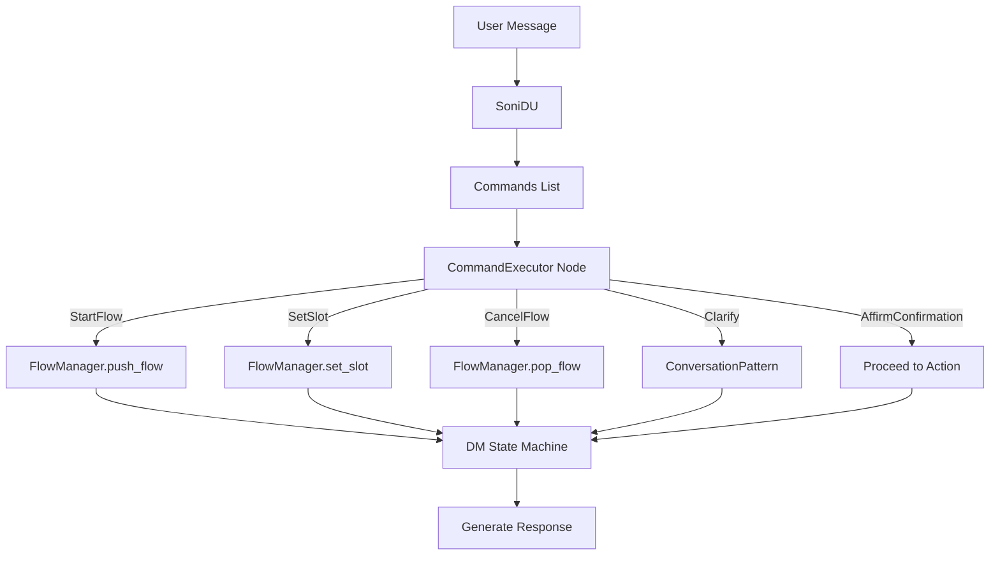

# Soni v2.0 Architecture Redesign - Implementation Plan

> **Goal**: Transform Soni from classification-driven to command-driven architecture, introducing deterministic DM and declarative Conversation Patterns.

## User Review Required

> [!IMPORTANT]
> This is a breaking redesign. No backwards compatibility is maintained.
> All existing tests will need updates. The DSL syntax changes significantly.

---

## Current State Analysis

### Current Architecture (v0.5)

```
User Message → NLU → message_type classification → Routing → Node Execution
```

**Issues identified**:
1. NLU produces `message_type` which the DM routes on (LLM controls flow)
2. Conversation patterns (correction, clarification) are ad-hoc nodes
3. No explicit intermediate representation between DU and DM
4. Single `message_type` per message (can't handle multiple intents)

### Current Components

| Component | Current State | Target State |
|-----------|--------------|--------------|
| `SoniDU` | Returns `NLUOutput` with `message_type` | Returns `list[Command]` |
| `route_after_understand` | Routes on `message_type` | Removed (replaced by CommandExecutor) |
| `DigressionHandler` | Handles questions/help | Becomes a Conversation Pattern |
| Individual handler nodes | `handle_correction`, `handle_digression`, etc. | Unified `execute_commands_node` |

---

## Target Architecture (v2.0)

### New Message Flow

```
User Message → NLU → [Commands] → CommandExecutor → DM State Machine → Response
```



### New Core Structures

#### Commands (New Module: `src/soni/core/commands.py`)

```python
from pydantic import BaseModel
from typing import Any

class Command(BaseModel):
    """Base command from DU to DM."""
    pass

class StartFlow(Command):
    """Start a new flow."""
    flow_name: str
    slots: dict[str, Any] = {}

class SetSlot(Command):
    """Set a slot value."""
    slot_name: str
    value: Any
    confidence: float = 1.0

class CorrectSlot(Command):
    """Correct a previously set slot."""
    slot_name: str
    new_value: Any

class CancelFlow(Command):
    """Cancel the current flow."""
    reason: str | None = None

class Clarify(Command):
    """User asks for clarification."""
    topic: str

class AffirmConfirmation(Command):
    """User confirms."""
    pass

class DenyConfirmation(Command):
    """User denies confirmation."""
    slot_to_change: str | None = None

class HumanHandoff(Command):
    """Request human agent."""
    reason: str | None = None

class ChitChat(Command):
    """General conversation."""
    response_hint: str | None = None

class OutOfScope(Command):
    """Request outside bot capabilities."""
    topic: str
```

#### Updated NLUOutput

```python
class NLUOutput(BaseModel):
    """NLU output with commands."""
    commands: list[Command]  # Multiple commands possible
    entities: list[ExtractedEntity]  # Raw extractions
    confidence: float
    reasoning: str
```

#### Conversation Patterns (New Module: `src/soni/patterns/`)

```python
class ConversationPattern(Protocol):
    """Protocol for conversation patterns."""

    def matches(self, command: Command, state: DialogueState) -> bool:
        """Check if pattern applies."""
        ...

    async def handle(
        self,
        command: Command,
        state: DialogueState,
        context: RuntimeContext
    ) -> dict[str, Any]:
        """Handle the pattern, return state updates."""
        ...
```

---

## Proposed Changes

### Phase 1: Core Infrastructure

---

#### [NEW] [commands.py](file:///Users/jorge/Projects/Playground/soni/src/soni/core/commands.py)

New module defining all Command types as Pydantic models.

---

#### [NEW] [executor.py](file:///Users/jorge/Projects/Playground/soni/src/soni/dm/executor.py)

New `CommandExecutor` class that deterministically executes commands.

---

#### [NEW] [patterns/](file:///Users/jorge/Projects/Playground/soni/src/soni/patterns/)

New package for Conversation Patterns:
- `base.py` - Protocol and base classes
- `correction.py` - CorrectionPattern
- `clarification.py` - ClarificationPattern
- `cancellation.py` - CancellationPattern
- `human_handoff.py` - HumanHandoffPattern
- `out_of_scope.py` - OutOfScopePattern
- `registry.py` - PatternRegistry

---

### Phase 2: DU Updates

---

#### [MODIFY] [signatures.py](file:///Users/jorge/Projects/Playground/soni/src/soni/du/signatures.py)

Update `DialogueUnderstanding` signature to output `list[Command]` instead of single `message_type`.

---

#### [MODIFY] [modules.py](file:///Users/jorge/Projects/Playground/soni/src/soni/du/modules.py)

Update `SoniDU` to produce commands.

---

### Phase 3: DM Refactoring

---

#### [DELETE] Individual handler nodes:
- `handle_correction.py`
- `handle_digression.py`
- `handle_modification.py`
- `handle_intent_change.py`

Replaced by unified `CommandExecutor`.

---

#### [MODIFY] [routing.py](file:///Users/jorge/Projects/Playground/soni/src/soni/dm/routing.py)

Simplify to only route based on DM state, not NLU classification.

---

#### [MODIFY] [builder.py](file:///Users/jorge/Projects/Playground/soni/src/soni/dm/builder.py)

Update graph construction for new architecture.

---

### Phase 4: DSL Updates

---

#### [MODIFY] DSL Specification (`docs/design/10-dsl-specification/`)

Add Conversation Patterns configuration:

```yaml
# soni.yaml
conversation_patterns:
  correction:
    enabled: true
    behavior: reprompt_corrected_slot

  clarification:
    enabled: true
    max_depth: 3
    fallback: human_handoff

  cancellation:
    enabled: true
    confirm_before_cancel: false

  human_handoff:
    enabled: true
    trigger_conditions:
      - clarification_depth > 3
      - explicit_request
```

---

### Phase 5: Design Documentation Updates

---

#### [MODIFY] [02-architecture.md](file:///Users/jorge/Projects/Playground/soni/docs/design/02-architecture.md)

- Add Command layer architecture
- Update data flow diagrams
- Document deterministic DM principle

---

#### [MODIFY] [03-components.md](file:///Users/jorge/Projects/Playground/soni/docs/design/03-components.md)

- Add CommandExecutor component
- Add PatternRegistry component
- Remove individual handler descriptions

---

#### [NEW] [11-commands.md](file:///Users/jorge/Projects/Playground/soni/docs/design/11-commands.md)

Complete Command layer specification.

---

#### [NEW] [12-conversation-patterns.md](file:///Users/jorge/Projects/Playground/soni/docs/design/12-conversation-patterns.md)

Conversation Patterns specification.

---

## Verification Plan

### Automated Tests

#### Unit Tests

```bash
# Run all unit tests
uv run pytest tests/unit/ -v

# Run specific test modules (to be created)
uv run pytest tests/unit/test_commands.py -v
uv run pytest tests/unit/test_command_executor.py -v
uv run pytest tests/unit/test_conversation_patterns.py -v
```

#### Integration Tests

```bash
# Run integration tests
uv run pytest tests/integration/ -v

# Run E2E flow tests
uv run pytest tests/integration/test_e2e_*.py -v
```

### New Test Files to Create

| Test File | Purpose |
|-----------|---------|
| `tests/unit/test_commands.py` | Command type validation |
| `tests/unit/test_command_executor.py` | Executor logic |
| `tests/unit/test_conversation_patterns.py` | Pattern matching/handling |
| `tests/integration/test_command_flow.py` | Full command-driven flow |

### Manual Verification

1. **CLI Test**: Run interactive session with banking example
   ```bash
   uv run soni run --config examples/banking/soni.yaml
   ```
   - Test slot collection
   - Test correction: "Actually I meant 100" after providing amount
   - Test clarification: "Why do you need that?"
   - Test interruption: "Check my balance" during transfer
   - Test cancellation: "Never mind"

2. **Optimization Test**: Verify DSPy optimization still works
   ```bash
   uv run soni optimize --config examples/banking/soni.yaml --trials 5
   ```

---

## Timeline Estimate

| Phase | Effort | Dependencies |
|-------|--------|--------------|
| Phase 1: Core Infrastructure | 2-3 days | None |
| Phase 2: DU Updates | 1-2 days | Phase 1 |
| Phase 3: DM Refactoring | 2-3 days | Phase 1, 2 |
| Phase 4: DSL Updates | 1 day | Phase 3 |
| Phase 5: Documentation | 1-2 days | All phases |
| Testing & Fixes | 2-3 days | All phases |
| **Total** | **9-14 days** | |

---

## Questions for User

1. Should I preserve any existing behavior or is a complete rewrite acceptable?
2. Any specific Conversation Patterns you want prioritized beyond the standard set?
3. Preferred naming: `Command` vs `Intent` vs `Action` for the intermediate representation?
