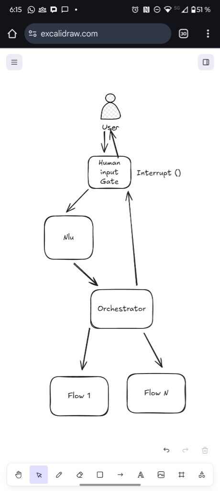
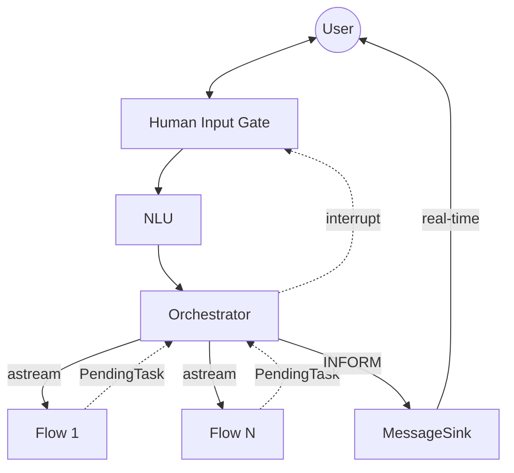
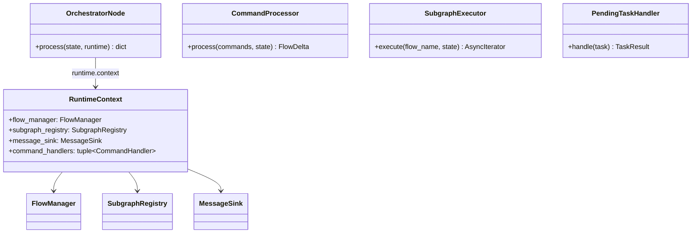
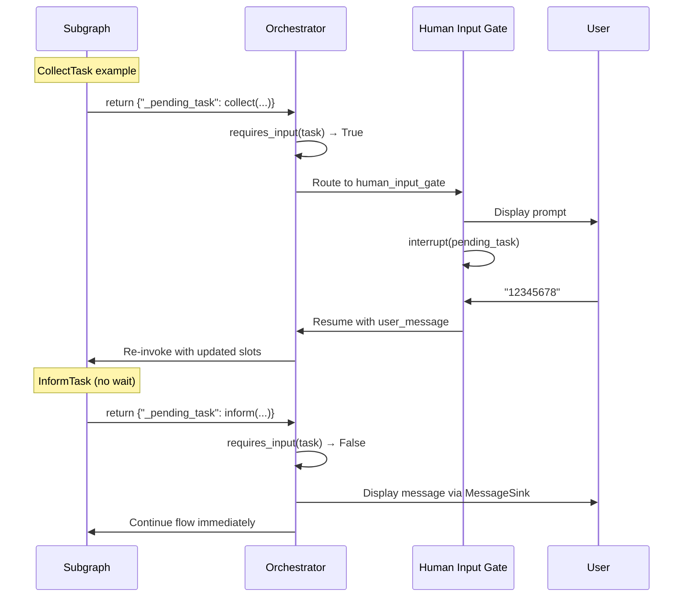

# ADR-002: Human Input Gate Architecture Analysis

## Executive Summary

This document analyzes the proposed architectural refactoring of the Soni framework's main graph to implement a **Human Input Gate** pattern. The key change is centralizing all user communication through a single gate node that manages message reception, interruptions, and user interactions.



---

## Key Assumptions

> [!IMPORTANT]
> **No Backward Compatibility Required**
>
> This refactoring does **not** require maintaining backward compatibility with the current architecture. Files can be directly replaced rather than creating parallel implementations with awkward names (e.g., `collect_enhanced.py`).

**Approach**:
- Backup existing files before replacing (e.g., move to `_backup/` or use git history)
- Use **clean, canonical names** for all files (e.g., `collect.py`, `confirm.py`, `orchestrator.py`)
- **Progressive cleanup**: Delete obsolete code as each phase is completed, not at the end
- No feature flags or gradual migration needed—this is a clean break

---

## Proposed Architecture

### Core Components

| Component | Responsibility |
|-----------|----------------|
| **Human Input Gate** | Single entry point for all user communication (receive messages, handle interrupts) |
| **NLU** | Processes user input; returns structured commands |
| **Orchestrator** | Decides what to do with commands: execute subgraph, push/pop flows, etc. |
| **Flow Subgraphs** | Individual flow implementations (Flow 1...N); never interrupt directly |

### Data Flow



### Key Architectural Principles

1. **Single Communication Point**: All user interaction goes through Human Input Gate
2. **Command-Driven**: NLU always produces commands; orchestrator decides what to do
3. **Non-Interrupting Subgraphs**: Flows return `PendingTask` instead of calling `interrupt()`
4. **Streaming Execution**: Orchestrator uses `.astream()` for real-time message delivery
5. **MessageSink Pattern**: `INFORM` messages are sent immediately via MessageSink interface

---

## Current Architecture Analysis

### Current Graph Structure

```
RuntimeLoop.process_message()
│
├─ Check snapshot.tasks → Resume path OR Fresh invoke
│
└─ Orchestrator Graph: understand → execute_flow → END
   │
   ├─ understand_node: Two-pass NLU, processes StartFlow/CancelFlow
   │
   └─ execute_flow_node:
      ├─ While loop with subgraph.ainvoke()
      ├─ Calls interrupt() directly for _need_input
      └─ Runs NLU on resume within the loop
```

### Current Implementation Details

#### [execute_flow.py](file:///Users/jorge/Projects/Playground/soni/src/soni/dm/nodes/execute_flow.py)

- **Lines 101-371**: Giant while-loop that:
  - Invokes subgraphs
  - Handles `_need_input` → calls `interrupt()` (line 180)
  - Runs NLU on resume value
  - Manages flow transitions, cancellations

#### [understand.py](file:///Users/jorge/Projects/Playground/soni/src/soni/dm/nodes/understand.py)

- Two-pass NLU architecture
- Processes `StartFlow` and `CancelFlow` before execute_flow

#### [loop.py](file:///Users/jorge/Projects/Playground/soni/src/soni/runtime/loop.py)

- **Lines 114-228**: Resume path runs NLU **before** `Command(resume=message)`
- Duplicates NLU logic that's also in `execute_flow_node`

### Current Problems

| Issue | Description |
|-------|-------------|
| **Scattered Interrupt Logic** | `interrupt()` called deep in execute_flow_node's while-loop |
| **Duplicate NLU Calls** | NLU runs in RuntimeLoop (resume), understand_node (fresh), AND execute_flow_node (loop resume) |
| **Tightly Coupled** | Subgraphs implicitly expect interrupt orchestration from parent |
| **Complex Resume Path** | RuntimeLoop must understand internal state to inject commands on resume |

---

## Required Changes

### 1. New Node: `human_input_gate`

> [!NOTE]
> This node is **pure** - it only needs state, no external dependencies. `RuntimeContext` is no longer needed here.

```python
# Location: src/soni/dm/nodes/human_input_gate.py

from typing import Any
from langgraph.types import interrupt

from soni.core.state import DialogueState


async def human_input_gate(state: DialogueState) -> dict[str, Any]:
    """Single entry point for all user communication.

    This is a pure node - no external dependencies needed.

    Responsibilities:
    1. Receive new user messages
    2. Handle resume from interrupts
    3. Process pending tasks from orchestrator
    """
    # Check if resuming from interrupt
    if state.get("_pending_task"):
        pending = state["_pending_task"]
        # Collect user response for pending task
        resume_value = interrupt(pending)
        return {
            "user_message": resume_value,
            "_pending_task": None,
        }

    # Normal message reception (already in user_message from invoke)
    return {}
```

### 2. Refactored Graph Structure

```python
def build_orchestrator(checkpointer=None):
    builder = StateGraph(DialogueState, context_schema=RuntimeContext)

    # Nodes
    builder.add_node("human_input_gate", human_input_gate_node)
    builder.add_node("nlu", nlu_node)
    builder.add_node("orchestrator", orchestrator_node)

    # Edges
    builder.set_entry_point("human_input_gate")
    builder.add_edge("human_input_gate", "nlu")
    builder.add_edge("nlu", "orchestrator")
    builder.add_conditional_edges(
        "orchestrator",
        route_after_orchestrator,
        {
            "pending_task": "human_input_gate",  # Loop back for interrupt
            "end": END,
        }
    )

    return builder.compile(checkpointer=checkpointer)
```

### 3. Orchestrator Architecture (SOLID Refactoring)

> [!IMPORTANT]
> The orchestrator applies **SRP** (separate components for each responsibility), **OCP** (extensible command handlers), and **DIP** (dependency injection).

#### 3.1 Component Overview



#### 3.2 Runtime Context (LangGraph's DIP Pattern)

> [!IMPORTANT]
> LangGraph provides **Runtime Context** as the official dependency injection mechanism. Dependencies are passed via `context_schema` when building the graph, and accessed via `runtime.context` in nodes. Context is **immutable and read-only** during execution.

```python
# Location: src/soni/runtime/context.py

from dataclasses import dataclass
from typing import Protocol

from langgraph.types import CompiledGraph

from soni.core.message_sink import MessageSink
from soni.flow.manager import FlowManager


class SubgraphRegistry(Protocol):
    """Registry for compiled flow subgraphs."""

    def get(self, flow_name: str) -> CompiledGraph:
        """Get compiled subgraph by flow name."""
        ...


@dataclass(frozen=True)
class RuntimeContext:
    """Immutable runtime context for LangGraph (DIP: depend on abstractions).

    This is passed via context_schema when building the graph, and accessed
    via runtime.context in nodes. It is read-only during execution.

    See: https://docs.langchain.com/oss/python/langgraph/how-tos/runtime-context
    """

    flow_manager: FlowManager
    subgraph_registry: SubgraphRegistry
    message_sink: MessageSink
    nlu_provider: "NLUProvider"  # For NLU node (SoniDU, SlotExtractor)

    # Optional: command handlers can be extended via context
    command_handlers: tuple["CommandHandler", ...] | None = None
```

#### 3.3 Graph Builder with context_schema

```python
# Location: src/soni/dm/builder.py

from langgraph.graph import StateGraph, END

from soni.core.state import DialogueState
from soni.runtime.context import RuntimeContext


def build_orchestrator(checkpointer=None):
    """Build the main orchestrator graph with RuntimeContext for DI."""

    # context_schema enables dependency injection via runtime.context
    builder = StateGraph(DialogueState, context_schema=RuntimeContext)

    # Nodes
    builder.add_node("human_input_gate", human_input_gate)
    builder.add_node("nlu", nlu_node)
    builder.add_node("orchestrator", orchestrator_node)

    # Edges
    builder.set_entry_point("human_input_gate")
    builder.add_edge("human_input_gate", "nlu")
    builder.add_edge("nlu", "orchestrator")
    builder.add_conditional_edges(
        "orchestrator",
        route_after_orchestrator,
        {"pending_task": "human_input_gate", "end": END}
    )

    return builder.compile(checkpointer=checkpointer)


# Usage: pass context when invoking
graph = build_orchestrator()
result = await graph.ainvoke(
    {"user_message": "Check my balance"},
    context=RuntimeContext(
        flow_manager=flow_manager,
        subgraph_registry=subgraph_registry,
        message_sink=WebSocketMessageSink(ws),
    ),
)
```

#### 3.4 Routing Function

```python
# Location: src/soni/dm/routing.py

from typing import Literal

from soni.core.state import DialogueState


def route_after_orchestrator(state: DialogueState) -> Literal["pending_task", "end"]:
    """Determine next step after orchestrator.

    If there's a pending task requiring user input, loop back to human_input_gate.
    Otherwise, end the graph execution.
    """
    pending = state.get("_pending_task")
    if pending:
        # CollectTask, ConfirmTask, or InformTask with wait_for_ack
        return "pending_task"
    return "end"
```

#### 3.3 Command Pattern (OCP: Open for Extension)

```python
# Location: src/soni/dm/orchestrator/commands.py

from abc import ABC, abstractmethod
from typing import Any

from soni.core.commands import Command
from soni.core.state import DialogueState
from soni.flow.delta import FlowDelta


class CommandHandler(ABC):
    """Abstract handler for processing NLU commands (OCP)."""

    @abstractmethod
    def can_handle(self, command: Command) -> bool:
        """Check if this handler can process the command."""
        ...

    @abstractmethod
    async def handle(
        self,
        command: Command,
        state: DialogueState,
        flow_manager: FlowManager,
    ) -> FlowDelta:
        """Process the command and return state changes."""
        ...


class StartFlowHandler(CommandHandler):
    """Handles StartFlow commands."""

    def can_handle(self, command: Command) -> bool:
        return command["type"] == "start_flow"

    async def handle(self, command, state, flow_manager) -> FlowDelta:
        return flow_manager.push_flow(state, command["flow_name"])


class CancelFlowHandler(CommandHandler):
    """Handles CancelFlow commands."""

    def can_handle(self, command: Command) -> bool:
        return command["type"] == "cancel_flow"

    async def handle(self, command, state, flow_manager) -> FlowDelta:
        return flow_manager.pop_flow(state)


class SetSlotHandler(CommandHandler):
    """Handles SetSlot commands."""

    def can_handle(self, command: Command) -> bool:
        return command["type"] == "set_slot"

    async def handle(self, command, state, flow_manager) -> FlowDelta:
        return flow_manager.set_slot(
            state,
            command["slot_name"],
            command["slot_value"],
        )


# Default handlers (easily extensible)
DEFAULT_HANDLERS: list[CommandHandler] = [
    StartFlowHandler(),
    CancelFlowHandler(),
    SetSlotHandler(),
]
```

#### 3.4 Command Processor (SRP)

```python
# Location: src/soni/dm/orchestrator/command_processor.py

from soni.flow.delta import FlowDelta, merge_deltas


class CommandProcessor:
    """Processes NLU commands and produces FlowDelta (SRP)."""

    def __init__(self, handlers: list[CommandHandler]):
        self._handlers = handlers

    async def process(
        self,
        commands: list[Command],
        state: DialogueState,
        flow_manager: FlowManager,
    ) -> FlowDelta:
        """Process all commands and return merged delta."""
        deltas: list[FlowDelta] = []

        for command in commands:
            for handler in self._handlers:
                if handler.can_handle(command):
                    delta = await handler.handle(command, state, flow_manager)
                    deltas.append(delta)
                    break

        return merge_deltas(deltas)
```

#### 3.5 Subgraph Executor (SRP) with Streaming

```python
# Location: src/soni/dm/orchestrator/executor.py

from collections.abc import AsyncIterator
from typing import Any

from soni.core.pending_task import PendingTask, is_inform, requires_input


class SubgraphExecutor:
    """Executes subgraphs with streaming support (SRP)."""

    def __init__(self, registry: SubgraphRegistry):
        self._registry = registry

    async def execute(
        self,
        flow_name: str,
        state: dict[str, Any],
    ) -> AsyncIterator[tuple[str, dict[str, Any]]]:
        """Stream subgraph execution, yielding (node_name, output) tuples."""
        subgraph = self._registry.get(flow_name)

        async for event in subgraph.astream(state, stream_mode="updates"):
            for node_name, output in event.items():
                yield node_name, output
```

#### 3.6 Pending Task Handler (SRP)

```python
# Location: src/soni/dm/orchestrator/task_handler.py

from dataclasses import dataclass
from enum import Enum

from soni.core.pending_task import PendingTask, is_inform, requires_input
from soni.core.message_sink import MessageSink


class TaskAction(Enum):
    """What to do after handling a pending task."""
    CONTINUE = "continue"      # Keep streaming
    INTERRUPT = "interrupt"    # Pause for user input
    COMPLETE = "complete"      # Flow finished


@dataclass
class TaskResult:
    action: TaskAction
    task: PendingTask | None = None


class PendingTaskHandler:
    """Handles pending tasks from subgraph outputs (SRP)."""

    def __init__(self, message_sink: MessageSink):
        self._sink = message_sink

    async def handle(self, task: PendingTask) -> TaskResult:
        """Process a pending task and determine next action."""

        if is_inform(task):
            # Always send INFORM messages immediately
            await self._sink.send(task["prompt"])

            if requires_input(task):
                # wait_for_ack=True: pause for acknowledgment
                return TaskResult(action=TaskAction.INTERRUPT, task=task)
            else:
                # Continue execution
                return TaskResult(action=TaskAction.CONTINUE)

        # COLLECT or CONFIRM: always interrupt
        return TaskResult(action=TaskAction.INTERRUPT, task=task)
```

#### 3.8 Orchestrator Node (Using Runtime Context)

```python
# Location: src/soni/dm/nodes/orchestrator.py

from typing import Any

from langgraph.types import Runtime

from soni.core.state import DialogueState
from soni.runtime.context import RuntimeContext
from soni.dm.orchestrator.commands import DEFAULT_HANDLERS
from soni.dm.orchestrator.command_processor import CommandProcessor
from soni.dm.orchestrator.executor import SubgraphExecutor
from soni.dm.orchestrator.task_handler import PendingTaskHandler, TaskAction


async def orchestrator_node(
    state: DialogueState,
    runtime: Runtime[RuntimeContext],  # LangGraph's DI pattern
) -> dict[str, Any]:
    """Orchestrator node - thin coordinator delegating to specialized components.

    Access dependencies via runtime.context (LangGraph pattern).

    Responsibilities:
    1. Delegate command processing to CommandProcessor
    2. Delegate subgraph execution to SubgraphExecutor
    3. Delegate task handling to PendingTaskHandler
    4. Merge results and return state updates
    """
    ctx = runtime.context  # Access injected dependencies

    # Initialize components using context dependencies
    handlers = ctx.command_handlers or DEFAULT_HANDLERS
    command_processor = CommandProcessor(handlers)
    executor = SubgraphExecutor(ctx.subgraph_registry)
    task_handler = PendingTaskHandler(ctx.message_sink)

    # 1. Process NLU commands
    delta = await command_processor.process(
        commands=state.get("commands", []),
        state=state,
        flow_manager=ctx.flow_manager,
    )
    updates = delta.to_dict()

    # 2. Get active flow
    merged_state = {**state, **updates}
    active_ctx = ctx.flow_manager.get_active_context(merged_state)

    if not active_ctx:
        return {**updates, "response": "How can I help?"}

    # 3. Stream subgraph execution
    subgraph_state = build_subgraph_state(merged_state)
    final_output: dict[str, Any] = {}

    async for node_name, output in executor.execute(active_ctx["flow_name"], subgraph_state):
        pending_task = output.get("_pending_task")

        if pending_task:
            result = await task_handler.handle(pending_task)

            if result.action == TaskAction.INTERRUPT:
                return {**updates, "_pending_task": result.task}

            if result.action == TaskAction.CONTINUE:
                continue

        # Accumulate output
        final_output = {**final_output, **output}

    # 4. Return merged result
    return {**updates, **transform_result(final_output)}
```

#### 3.8 Benefits of This Design

| Principle | Applied | Benefit |
|-----------|---------|---------|
| **SRP** | Each class has one responsibility | Easy to understand, test, modify |
| **OCP** | CommandHandler is extensible | Add new commands without modifying existing code |
| **DIP** | Depend on abstractions (protocols) | Easy to mock, swap implementations |
| **DRY** | `requires_input()` centralizes logic | No duplicated conditionals |
| **Testable** | Components are isolated | Unit test each piece independently |

#### 3.9 MessageSink Interface

```python
# Location: src/soni/core/message_sink.py

from abc import ABC, abstractmethod


class MessageSink(ABC):
    """Interface for streaming messages to the user in real-time (DIP)."""

    @abstractmethod
    async def send(self, message: str) -> None:
        """Send a message to the user immediately."""
        ...


class WebSocketMessageSink(MessageSink):
    """WebSocket-based real-time delivery."""

    def __init__(self, websocket: "WebSocket"):
        self._ws = websocket

    async def send(self, message: str) -> None:
        await self._ws.send_json({"type": "message", "content": message})


class BufferedMessageSink(MessageSink):
    """Buffers messages for testing or batch delivery."""

    def __init__(self):
        self.messages: list[str] = []

    async def send(self, message: str) -> None:
        self.messages.append(message)
```

### 4. Modified Subgraphs: Return `PendingTask` Instead of Interrupt

Current subgraph nodes call `interrupt()` directly. They must be changed to return a `PendingTask`:

```python
# BEFORE (in collect_node, confirm_node, etc.)
async def collect_node(state, runtime):
    if not slot_value:
        prompt = interpolate(config.message, state)
        interrupt({"slot": config.slot, "prompt": prompt})  # BLOCKS
        # unreachable

# AFTER
async def collect_node(state, runtime):
    if not slot_value:
        prompt = interpolate(config.message, state)
        return {
            "_pending_task": collect(
                prompt=prompt,
                slot=config.slot,
            ),
        }
    # continue...
```

### 5. PendingTask Data Structure (ISP: Interface Segregation)

`PendingTask` is the core data structure that subgraphs return when they need user input. It replaces the current pattern of calling `interrupt()` directly within subgraph nodes.

> [!NOTE]
> **ISP Applied**: Instead of one generic TypedDict with many optional fields, we use a **union of specific types**. Each task type declares only the fields it needs.

#### Type Definitions

```python
# Location: src/soni/core/pending_task.py

from typing import Any, Literal, NotRequired, TypedDict


# ─────────────────────────────────────────────────────────────────
# Specific Task Types (ISP: each type has only the fields it needs)
# ─────────────────────────────────────────────────────────────────

class CollectTask(TypedDict):
    """Task that collects a slot value from the user."""

    type: Literal["collect"]
    prompt: str
    slot: str  # REQUIRED for collect
    options: NotRequired[list[str]]  # Quick-reply suggestions
    metadata: NotRequired[dict[str, Any]]


class ConfirmTask(TypedDict):
    """Task that asks user for confirmation (yes/no/cancel)."""

    type: Literal["confirm"]
    prompt: str
    options: list[str]  # REQUIRED: ["yes", "no"] or ["yes", "no", "cancel"]
    metadata: NotRequired[dict[str, Any]]


class InformTask(TypedDict):
    """Task that displays information to the user."""

    type: Literal["inform"]
    prompt: str
    wait_for_ack: NotRequired[bool]  # Default: False (continue immediately)
    options: NotRequired[list[str]]  # For acknowledgment: ["OK", "Got it"]
    metadata: NotRequired[dict[str, Any]]


# ─────────────────────────────────────────────────────────────────
# Union Type (discriminated union on "type" field)
# ─────────────────────────────────────────────────────────────────

PendingTask = CollectTask | ConfirmTask | InformTask
"""Union of all pending task types. Discriminated by the 'type' field."""
```

#### Type Behavior Summary

| Type | Pauses Flow? | Required Fields | Use Case |
|------|--------------|-----------------|----------|
| `CollectTask` | ✅ Always | `slot` | "What's your account number?" |
| `ConfirmTask` | ✅ Always | `options` | "Transfer $500. Proceed?" |
| `InformTask` | ⚙️ Depends on `wait_for_ack` | — | "Your balance is $1,234" |

#### Factory Functions (Type-Safe Construction)

```python
# Location: src/soni/core/pending_task.py

def collect(
    prompt: str,
    slot: str,
    *,
    options: list[str] | None = None,
    metadata: dict[str, Any] | None = None,
) -> CollectTask:
    """Create a CollectTask to gather a slot value from the user."""
    task: CollectTask = {"type": "collect", "prompt": prompt, "slot": slot}
    if options:
        task["options"] = options
    if metadata:
        task["metadata"] = metadata
    return task


def confirm(
    prompt: str,
    options: list[str] | None = None,
    *,
    metadata: dict[str, Any] | None = None,
) -> ConfirmTask:
    """Create a ConfirmTask to ask for user confirmation."""
    return {
        "type": "confirm",
        "prompt": prompt,
        "options": options or ["yes", "no"],
        **({"metadata": metadata} if metadata else {}),
    }


def inform(
    prompt: str,
    *,
    wait_for_ack: bool = False,
    options: list[str] | None = None,
    metadata: dict[str, Any] | None = None,
) -> InformTask:
    """Create an InformTask to display information to the user."""
    task: InformTask = {"type": "inform", "prompt": prompt}
    if wait_for_ack:
        task["wait_for_ack"] = True
    if options:
        task["options"] = options
    if metadata:
        task["metadata"] = metadata
    return task
```

#### Type Guards (Runtime Type Checking)

```python
# Location: src/soni/core/pending_task.py

def is_collect(task: PendingTask) -> bool:
    """Check if task is a CollectTask."""
    return task["type"] == "collect"


def is_confirm(task: PendingTask) -> bool:
    """Check if task is a ConfirmTask."""
    return task["type"] == "confirm"


def is_inform(task: PendingTask) -> bool:
    """Check if task is a InformTask."""
    return task["type"] == "inform"


def requires_input(task: PendingTask) -> bool:
    """Check if this task requires user input (pauses flow)."""
    if task["type"] in ("collect", "confirm"):
        return True
    if task["type"] == "inform":
        return task.get("wait_for_ack", False)
    return False
```

#### Field Details (per Type)

**CollectTask**:
| Field | Type | Required | Description |
|-------|------|----------|-------------|
| `type` | `Literal["collect"]` | ✅ | Always `"collect"` |
| `prompt` | `str` | ✅ | Message shown to user |
| `slot` | `str` | ✅ | Slot name to populate with user's response |
| `options` | `list[str]` | Optional | Quick-reply suggestions |
| `metadata` | `dict[str, Any]` | Optional | Extra context |

**ConfirmTask**:
| Field | Type | Required | Description |
|-------|------|----------|-------------|
| `type` | `Literal["confirm"]` | ✅ | Always `"confirm"` |
| `prompt` | `str` | ✅ | Confirmation question |
| `options` | `list[str]` | ✅ | Available choices (`["yes", "no"]`) |
| `metadata` | `dict[str, Any]` | Optional | Extra context |

**InformTask**:
| Field | Type | Required | Description |
|-------|------|----------|-------------|
| `type` | `Literal["inform"]` | ✅ | Always `"inform"` |
| `prompt` | `str` | ✅ | Information to display |
| `wait_for_ack` | `bool` | Optional | If True, pause for acknowledgment |
| `options` | `list[str]` | Optional | Acknowledgment options (`["OK"]`) |
| `metadata` | `dict[str, Any]` | Optional | Extra context |

#### Creation Examples

```python
from soni.core.pending_task import collect, confirm, inform

# 1. Collect slot value
pending = collect(
    prompt="What is your account number?",
    slot="account_number",
    metadata={"expected_format": "8 digits"},
)

# 2. Confirm action (with default options)
pending = confirm(
    prompt="Transfer $500 from Checking to Savings. Proceed?",
)  # options defaults to ["yes", "no"]

# 3. Confirm with custom options
pending = confirm(
    prompt="Cancel this transfer?",
    options=["yes", "no", "go back"],
)

# 4. Inform - action result (no wait, flow continues)
pending = inform(
    prompt="Your balance is $1,234.56",
    metadata={"action": "check_balance"},
)

# 5. Inform - with acknowledgment (wait for user)
pending = inform(
    prompt="Transfer completed successfully!",
    wait_for_ack=True,
)

# 6. Inform - disclaimer with options
pending = inform(
    prompt="This account has a daily transfer limit of $10,000.",
    wait_for_ack=True,
    options=["OK", "Got it"],
)
```

#### Usage in Nodes

```python
from soni.core.pending_task import collect, confirm, inform, requires_input

# In collect_node (subgraph)
async def collect_node(state: FlowState, runtime: Runtime) -> dict[str, Any]:
    slot_value = state["flow_slots"].get(config.slot)

    if not slot_value:
        prompt = interpolate(config.message, state)
        return {
            "_pending_task": collect(
                prompt=prompt,
                slot=config.slot,
            ),
        }

    # Slot has value, continue...
    return {}


# In confirm_node (subgraph)
async def confirm_node(state: FlowState, runtime: Runtime) -> dict[str, Any]:
    if not state.get("_confirmed"):
        prompt = build_confirmation_message(state)
        return {
            "_pending_task": confirm(prompt=prompt),
        }

    # Already confirmed
    return {}


# In action_node (subgraph) - using inform for result
async def action_node(state: FlowState, runtime: Runtime) -> dict[str, Any]:
    result = await execute_action(state)

    return {
        "_pending_task": inform(
            prompt=result.message,  # e.g., "Your balance is $1,234"
            wait_for_ack=False,     # Flow continues after showing result
        ),
    }
```

#### Flow Through Architecture



---

## Streaming vs Batch Execution

### Why `.astream()` Instead of `.ainvoke()`?

| Aspect | `.ainvoke()` | `.astream()` |
|--------|-------------|--------------|
| **Execution** | Runs entire graph, returns final state | Yields intermediate states as nodes complete |
| **Message Delivery** | All messages returned at end | Messages sent in real-time |
| **User Experience** | User waits for all processing | User sees progress immediately |
| **INFORM handling** | Accumulate, return together | Send immediately via MessageSink |

### Decision: Use `.astream()` for Real-Time UX

We chose streaming for these reasons:

1. **Immediate Feedback**: Users see `INFORM` messages (like "Processing...") as they happen
2. **Natural Conversation**: Responses feel more conversational, less "batch-processed"
3. **Progress Indication**: Long-running flows can show intermediate status
4. **Action Results**: Action outputs (balances, confirmations) appear instantly

### How It Works

```python
# Orchestrator streams subgraph execution
async for event in subgraph.astream(state, stream_mode="updates"):
    for node_name, output in event.items():
        if output.get("_pending_task", {}).get("type") == "inform":
            # Send to user NOW, don't wait
            await message_sink.send(output["_pending_task"]["prompt"])
```

### MessageSink Integration

The `MessageSink` interface abstracts how messages reach the user:

| Implementation | Use Case |
|----------------|----------|
| `WebSocketMessageSink` | Real-time web apps |
| `SSEMessageSink` | Server-Sent Events for HTTP |
| `BufferedMessageSink` | Testing, batch APIs |
| `CallbackMessageSink` | Custom integrations |

---

## Files to Modify

> [!NOTE]
> Files are **replaced directly** with clean names. No need for suffixes like `_enhanced` or `_v2`. Git history serves as backup.

### Core Graph Changes

| File | Action | Description |
|------|--------|-------------|
| [builder.py](file:///Users/jorge/Projects/Playground/soni/src/soni/dm/builder.py) | **MODIFY** | Redesign graph: add `human_input_gate`, `nlu`, `orchestrator` nodes |
| [execute_flow.py](file:///Users/jorge/Projects/Playground/soni/src/soni/dm/nodes/execute_flow.py) | **DELETE** | Remove entirely—replaced by orchestrator module |
| [understand.py](file:///Users/jorge/Projects/Playground/soni/src/soni/dm/nodes/understand.py) | **SIMPLIFY** | Pure NLU only (remove flow command processing) |
| `human_input_gate.py` | **NEW** | Create `dm/nodes/human_input_gate.py` |
| [loop.py](file:///Users/jorge/Projects/Playground/soni/src/soni/runtime/loop.py) | **SIMPLIFY** | Remove NLU-on-resume logic |

### New Orchestrator Module (SRP)

| File | Action | Description |
|------|--------|-------------|
| `runtime/context.py` | **MODIFY** | Add `RuntimeContext` dataclass, `SubgraphRegistry` protocol |
| `dm/orchestrator/__init__.py` | **NEW** | Package init |
| `dm/orchestrator/commands.py` | **NEW** | `CommandHandler` ABC + implementations (StartFlow, CancelFlow, SetSlot) |
| `dm/orchestrator/command_processor.py` | **NEW** | `CommandProcessor` class |
| `dm/orchestrator/executor.py` | **NEW** | `SubgraphExecutor` class (streaming) |
| `dm/orchestrator/task_handler.py` | **NEW** | `PendingTaskHandler`, `TaskAction`, `TaskResult` |
| `dm/nodes/orchestrator.py` | **NEW** | Thin `orchestrator_node` using `runtime.context` |

### New PendingTask Module (ISP)

| File | Action | Description |
|------|--------|-------------|
| `core/pending_task.py` | **NEW** | `CollectTask`, `ConfirmTask`, `InformTask`, union type, factory functions, type guards |

### Subgraph Changes

| File | Action | Description |
|------|--------|-------------|
| [subgraph.py](file:///Users/jorge/Projects/Playground/soni/src/soni/compiler/subgraph.py) | **MODIFY** | Update subgraph nodes to return `PendingTask` |
| `collect.py` | **MODIFY** | Use `collect()` factory, return instead of `interrupt()` |
| `confirm.py` | **MODIFY** | Use `confirm()` factory, return instead of `interrupt()` |
| `action.py` | **MODIFY** | Use `inform()` factory for action results |

### Infrastructure

| File | Action | Description |
|------|--------|-------------|
| `core/message_sink.py` | **NEW** | `MessageSink` ABC + implementations |

---

## State Changes

### DialogueState Additions

```python
class DialogueState(TypedDict):
    # ... existing fields ...

    # NEW: Pending task from subgraph (union type)
    _pending_task: NotRequired[CollectTask | ConfirmTask | InformTask | None]
```

### Remove/Deprecate

```python
# Remove entirely:
_need_input: bool        # No longer needed (use requires_input())
_pending_prompt: dict    # Replaced by _pending_task
```

---

## Benefits of New Architecture

| Benefit | Description |
|---------|-------------|
| **Single Entry Point** | All user communication via Human Input Gate |
| **Clear Separation** | NLU → Commands → Orchestrator → Subgraphs |
| **No Duplicate NLU** | NLU runs once, after Human Input Gate |
| **Simpler Subgraphs** | Return `PendingTask`, no interrupt complexity |
| **Testable** | Each node is independently testable |
| **LangGraph Aligned** | Uses recommended "invoke from node" pattern |

---

## Risks and Mitigations

### Risk: Breaking Changes

The subgraph interface changes fundamentally. All existing flow compilation logic must be updated.

**Mitigation**:
- Backup existing files before replacement (git history serves as backup)
- Comprehensive test coverage before deploying
- Clean break—no need for parallel architectures or feature flags

### Risk: State Persistence

Current interrupt() persists state automatically. Manual invoke-from-node requires explicit state management.

**Mitigation**:
- Orchestrator explicitly merges subgraph results
- Checkpointer only at orchestrator level

### Risk: Performance

Multiple node transitions may add latency.

**Mitigation**:
- Profile before/after
- LangGraph node transitions are lightweight

---

## Implementation Phases

### Phase 1: Core Types & Infrastructure (1-2 days)
- [ ] Create `core/pending_task.py` (CollectTask, ConfirmTask, InformTask, factories, guards)
- [ ] Create `core/message_sink.py` (MessageSink ABC + implementations)
- [ ] Add `_pending_task` to DialogueState

### Phase 2: Orchestrator Module (2-3 days)
- [ ] Modify `runtime/context.py` (add RuntimeContext, SubgraphRegistry protocol)
- [ ] Create `dm/orchestrator/commands.py` (CommandHandler ABC + handlers)
- [ ] Create `dm/orchestrator/command_processor.py`
- [ ] Create `dm/orchestrator/executor.py` (SubgraphExecutor)
- [ ] Create `dm/orchestrator/task_handler.py` (PendingTaskHandler)
- [ ] Create `dm/nodes/orchestrator.py` (thin coordinator using runtime.context)

### Phase 3: Human Input Gate & Graph (1-2 days)
- [ ] Create `dm/nodes/human_input_gate.py`
- [ ] Modify `dm/builder.py` with new graph structure
- [ ] Simplify `runtime/loop.py` (remove NLU-on-resume)

### Phase 4: Subgraph Migration (2 days)
- [ ] Modify `collect_node` to use `collect()` factory
- [ ] Modify `confirm_node` to use `confirm()` factory
- [ ] Modify `action_node` to use `inform()` factory
- [ ] Update subgraph builder

### Phase 5: Cleanup & Testing (1 day)
- [ ] Delete `dm/nodes/execute_flow.py`
- [ ] Remove `_need_input` and `_pending_prompt` from state
- [ ] Update all tests
- [ ] Documentation

**Estimated Total**: 7-10 days

---

## Appendix: LangGraph "Invoke from Node" Pattern

From the [LangGraph documentation](https://docs.langchain.com/oss/python/langgraph/use-subgraphs#invoke-a-graph-from-a-node):

```python
def call_subgraph(state: State):
    # Transform the state to the subgraph state
    subgraph_output = subgraph.invoke({"bar": state["foo"]})
    # Transform response back to the parent state
    return {"foo": subgraph_output["bar"]}
```

Key points:
1. Subgraph is invoked synchronously from within a node
2. State is transformed before/after invocation
3. Parent graph controls orchestration
4. Subgraph results are read and merged by the calling node

This pattern ensures the orchestrator can:
- Read subgraph results immediately
- Decide whether to loop back to Human Input Gate
- Manage flow stack transitions explicitly

---

## Conclusion

The proposed Human Input Gate architecture provides:

1. **Clean separation of concerns** via SOLID principles:
   - **SRP**: Each component has one responsibility
   - **OCP**: CommandHandler pattern allows extension without modification
   - **ISP**: PendingTask uses union types instead of one generic type
   - **DIP**: Dependencies injected via RuntimeContext (LangGraph pattern)

2. **DRY implementation**: Logic like `requires_input()` is centralized

3. **LangGraph alignment**: Uses streaming (`.astream()`) and invoke-from-node patterns

4. **Testability**: Each component can be unit tested independently

The estimated effort is **7-10 days** for a complete migration. Since backward compatibility is not required, the migration is a clean break with no parallel architecture overhead.
