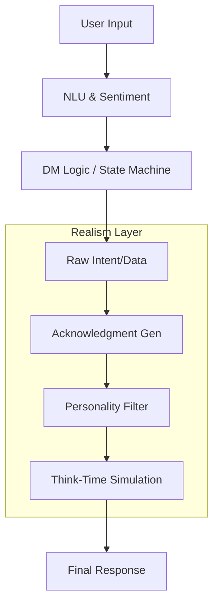

# Strategy: Realism & Human-Like conversational Experience

**Status**: Proposal
**Date**: 2025-12-15
**Target Version**: v1.1+
**Objective**: Transform Soni from a transactional task-bot into a conversational agent with personality, empathy, and natural dialogue dynamics.

---

## 1. Executive Summary

Soni's current architecture excels at **correctness** and **task completion** thanks to its Unified NLU, DSPy optimization, and LangGraph integration. However, the resulting user experience is "robotic" and transactional.

To bridge the gap to a "super realistic" experience, we must introduce a **Human-Like Layer** that operates *alongside* the logic layer. This strategy details how to implement this layer without compromising the solidity of the underlying state machine.

---

## 2. Gap Analysis: The "Uncanny Valley" of Task Bots

We have identified 6 critical gaps that prevent realistic interaction:

| Gap | Current Behavior | Realistic Expectation |
|-----|------------------|-----------------------|
| **Template Rigidity** | "Where would you like to fly from?" (Always identical) | "Let's get started. Where are you flying from?" vs "Okay, and what's the departure city?" (Variety) |
| **Amnesia** | Forgets everything not in a slot. | "Like I mentioned earlier..." callbacks and context awareness. |
| **Mechanical Confirmation** | Bullet-point lists: "Confirm: - A: X - B: Y" | "So you want to fly to Paris on Friday? Just checking." |
| **Reactive Only** | Waits for user. Never suggests. | "Since you're checking your balance, do you want to pay that bill too?" |
| **Cold Errors** | "Invalid Input: [Date]." | "I didn't quite catch that date. Could you try 'DD/MM/YYYY'?" |
| **Personality Void** | Tone is null/neutral. | Consistent character (e.g., helpful, concise, warm). |

---

## 3. Strategic Pillars

We will address these gaps through 5 strategic pillars.

### Pillar 1: Natural Language Generation (NLG) Engine

**Objective**: Eliminate template-based responses in favor of dynamic, context-aware generation.

**Architectural Change**:
Replace `generate_response.py`'s template logic with a delegated `INLGProvider`.

**Interface**:
```python
class INLGProvider(Protocol):
    async def generate_response(
        self,
        intent: ResponseIntent,
        context: DialogueContext,
        personality: PersonalityConfig
    ) -> str: ...
```

**Implementation Strategy**:
*   **Hybrid Approach**: Use valid templates for high-speed paths (sanity checks) and LLM-generation for conversational turns.
*   **Variety Injection**: If using templates, support arrays of variants:
    ```yaml
    prompts:
      - "What's your destination?"
      - "Where are you heading?"
      - "Destination city?"
    ```

### Pillar 2: Contextual Acknowledgments

**Objective**: mimic human active listening.

**Concept**:
Humans rarely switch topics instantly. We acknowledge receipt of information before moving on.

**Flow**:
1.  **User**: "I want to send $500."
2.  **Current Bot**: "To whom?" (Jarring transition)
3.  **Realistic Bot**: "Got it, $500. And who is this going to?" (Acknowledgment + Transition)

**Technical Implementation**:
*   Inject an `AcknowledgmentLayer` in the response pipeline.
*   Uses `last_slot_filled` and `slot_value` to generate micro-confirmations.
*   **Stochasticity**: Only acknowledge ~70% of the time to avoid repetitiveness.

### Pillar 3: Personality & Tone System

**Objective**: Give the bot a consistent "Soul".

**DSL Extension (`soni.yaml`)**:
```yaml
personality:
  name: "Soni"
  traits:
    warmth: 0.8        # High warmth
    conciseness: 0.4   # More conversational
    humor: 0.2         # Subtle humor
  voice:
    style: "casual_professional" # "Hey there" vs "Greetings"
    emoji_usage: "moderate"
```

**Runtime Application**:
The `INLGProvider` consumes this config to modulate response generation (e.g., appended to the System Prompt of the NLG model).

### Pillar 4: Empathy & Sentiment Adaptation

**Objective**: Detect frustration/urgency and adapt flow.

**Mechanism**:
*   **Sentiment Analysis** step in `understand_node`.
*   **State Tracking**: Add `sentiment: {valence: float, arousal: float}` to `DialogueState`.
*   **Adaptive Routing**:
    *   If `frustration > 0.8` → Switch `personality.conciseness` to 1.0 (Stop chatting, solve problem).
    *   If `urgency > 0.8` → Skip optional steps.

### Pillar 5: Soft Error Recovery

**Objective**: Turn errors into conversations.

**Strategy**:
*   **Progressive Disclosure**:
    *   Attempt 1: Soft prompt ("I didn't catch that.")
    *   Attempt 2: Specific guidance ("I need a date in MM/DD format.")
    *   Attempt 3: Offer choices/examples.
*   **Blame Shifting**: The bot should seemingly take blame for understanding failures ("My bad, I'm having trouble understanding...") rather than blaming the user ("Invalid input").

---

## 4. Technical Architecture: The "Realism Layer"

We propose inserting a **Realism Layer** between the Logic Core and the User.



### New Component: `ResponseEnricher`

```python
class ResponseEnricher:
    """Enriches raw logical responses with human qualities."""

    async def enrich(
        self,
        raw_response: str,
        state: DialogueState
    ) -> str:
        # 1. Add acknowledgment if distinct slot filled
        ack = self._generate_acknowledgment(state)

        # 2. Apply personality transfer
        styled = self._apply_personality(raw_response + ack)

        # 3. Add delays (for UI simulation)
        # (Managed by outside loop, but calculated here)

        return styled
```

---

## 5. Detailed Implementation Roadmap

### Phase 1: Quick Wins (Low Effort / High Impact)
*   [ ] **DSL**: Add support for `prompt` arrays (variability) in `soni.yaml`.
*   [ ] **Validation**: Rewrite all hardcoded error messages in `validate_slot.py` to be softer/varied.
*   [ ] **Config**: Add basic `personality` section to yaml context.

### Phase 2: The NLG Pipeline (Medium Effort)
*   [ ] **Interface**: Define `INLGProvider`.
*   [ ] **Integration**: Hook `INLGProvider` into `generate_response_node`.
*   [ ] **LLM Impl**: Create `LLMNLGProvider` using the configured LLM to rewrite responses.

### Phase 3: Advanced Dynamics (High Effort)
*   [ ] **Memory**: Implement `ConversationMemory` logic to track non-slot entities.
*   [ ] **Proactivity**: Build the `SuggestionEngine` to query available flows for "related actions".
*   [ ] **Sentiment**: Add sentiment analysis to DSPy signature.

---

## 6. Example: Before vs. After

### Scenario: Banking Transfer

**Current Soni (Before)**
> **User**: I want to transfer money.
> **Bot**: To whom?
> **User**: Mom.
> **Bot**: How much?
> **User**: 500.
> **Bot**: Confirm transfer of 500 to Mom?

**Realistic Soni (After)**
> **User**: I want to transfer money.
> **Bot**: Sure thing. Who are we sending money to today?
> **User**: Mom.
> **Bot**: Okay, to Mom. And how much would you like to send?
> **User**: 500.
> **Bot**: Got it, $500. Just to double-check — that's $500 going to Mom, right?

---

## 7. DSL Specifications

### Enhanced `soni.yaml` Schema

```yaml
# New Top-Level Section
personality:
  name: "Soni"
  style: "warm_professional"

# Enhanced Slot Definition
slots:
  amount:
    type: float
    # Array of prompts for variety
    prompts:
      - "How much?"
      - "What's the amount?"
      - "How much are we sending?"
    # Contextual acknowledgments
    acknowledgments:
      - "Got it."
      - "{value}, noted."
      - "Okay, ${value}."
    # Soft error messages
    error_messages:
      invalid_type: "I didn't catch that amount. Could you say it again?"
```
